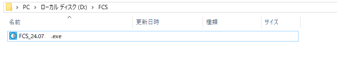
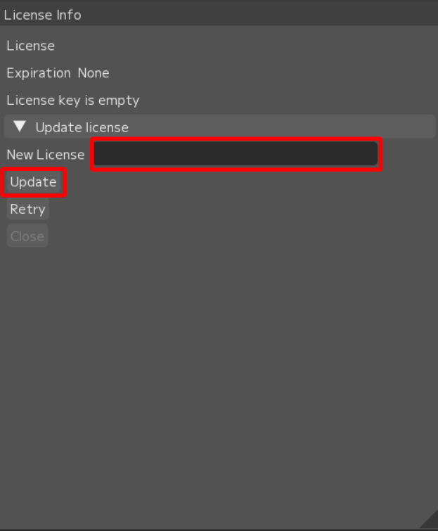
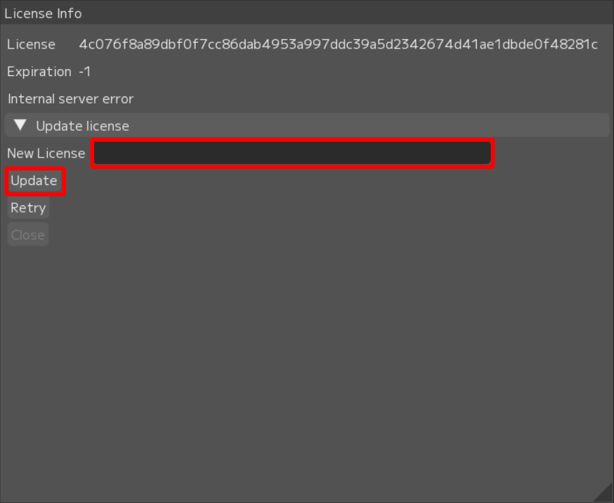

## FCS起動



任意の場所に保存した「exeファイル」をダブルクリックし起動してください。  
インストール不要なプログラムになります。


```{note}
初回起動時、PC環境によってセキュリティソフトでブロックされることがあります。  
その際には、[HELTECホームページ](https://sensing.heltec.co.jp/contact/)からお問い合わせください。
```

### ライセンスの入力

FCS初回起動時ライセンスキーの入力を求められます。  
 - New Licenseにライセンスキーを入力  
 - Update  
  

ライセンス認証完了後FCSを操作できるようになります。


### ライセンスの更新

FCSを起動後、ライセンスの期限切れだった場合にはLicenseInfoがポップします。  
 - 新しいライセンスキーをNew Licenseに入力  
 - Update


```{note}
Updateを押しても正常に動作しない場合があります。   
その際には、[HELTECホームページ](https://sensing.heltec.co.jp/contact/)からお問い合わせください。
```
