## Session作成もしくはオープン
FCS起動後、「session」と呼ばれるプロジェクトファイルにアクセスするため
「New...（新規作成）またはOpen（開く）」を実行します。

### Create new Sessionで作成されるフォルダ構造
赤枠：Project Folderで作成されるフォルダ
青枠：Actorで作成されるフォルダ
緑枠：Characterで作成されるフォルダ
.lock/fcs_session.yaml：sessionをSaveした後に作成されるファイル
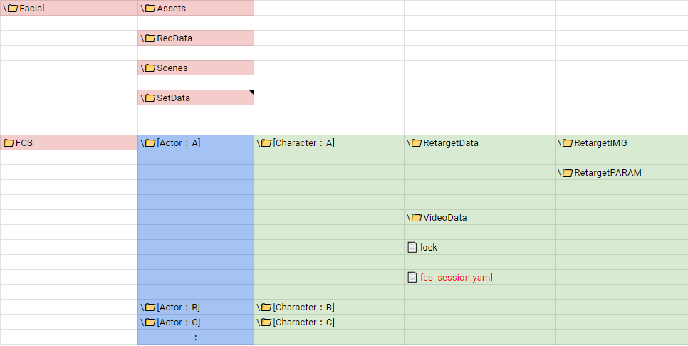

📁Facial：動画やMayaシーンデータ等素材を保存する場所
	📁Assets：Mayaのプロジェクトファイル（Assets以下）を保存する場所。
	📁RecData：FCSで解析したい動画を保存する場所。
	📁Scene：アニメーション出力時のデフォルト出力先。
	📁SetData：アニメーション出力で「audio」を選択した場合にはwavファイルが、
			「Frame」「Landmark Frame」を選択した場合は連番画像が作成され、保存される。
📁FCS：解析に使用するデータが保存されるプロジェクトフォルダ。
	📁Actor：Actorで作成したフォルダ。Actorで入力した名前が表記される。
	📁Character：Characterで作成したフォルダ。Characterで入力した名前が表記される。
	📁RetargetData（IMG/PARAM）：作成したProfileの編集データ（画像や数値情報）が保存される
	📁VideoData：解析する動画のキャッシュが保存される
	📄.lock：競合を防ぐためのロックファイル。起動時/終了時に自動で作成/消去される。
	📄 fcs_session.yaml：session情報を保存しているファイル

### sessionの新規作成   

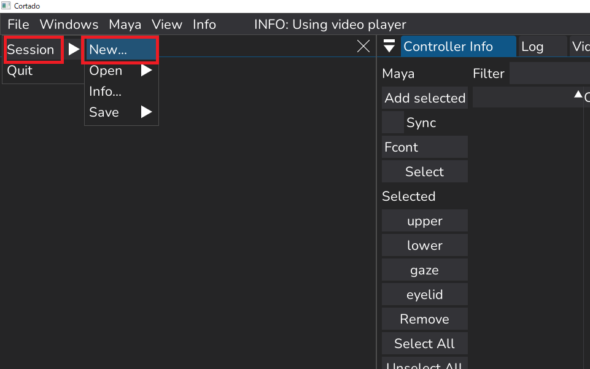
File▶Session▶New…を選択

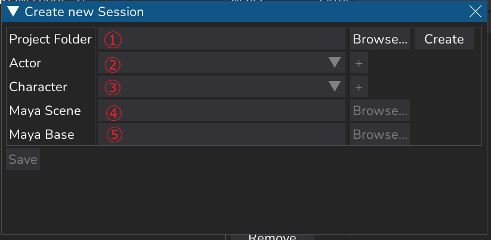
①Project Folder：FCSの作業データを置きたい場所を指定 
②Actor：モーションキャプチャアクター名 
③character：3Dモデルのキャラクター名
④Maya scene：3DモデルのMayaシーンへのパス
⑤MayaBase：Assets、workspace.melがあるフォルダへのパス

#### ①Project Folderの設定

Browse ボタンで
FCSの作業データフォルダを格納する場所
＝Project Folder
を指定するためウィンドウを起動
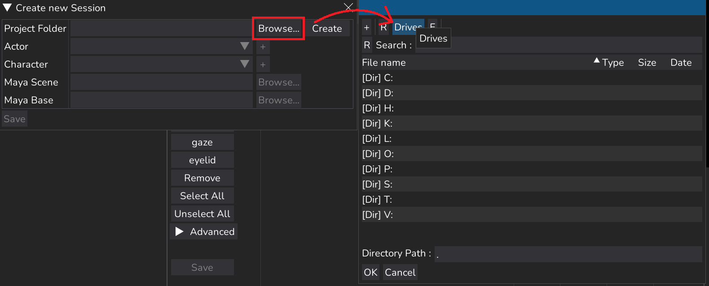

Drive　ボタンで
作業者PC環境のローカルネットワークドライブを表示
Project Folderを作成したい場所を選択したら
OK
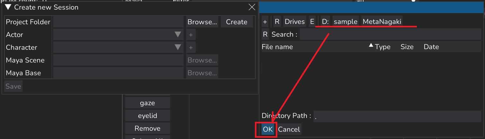

Project Folderに指定した場所が反映されていたら
Create
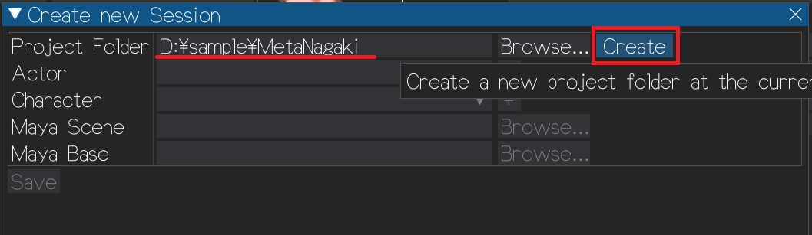

問題なく作成できたら画像のポップアップが出ます
close
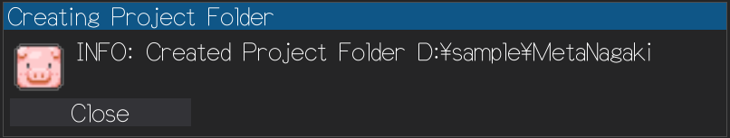

エクスプローラーで
「Facial」「FCS」のフォルダが作成されます
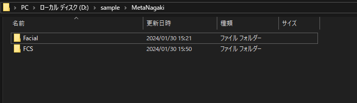

```{note}
★Project Folder作成後
・AssetsフォルダへMayaのデータ
・RecDataフォルダへ解析に使用する動画素材
を移動しておくことを推奨します
※別の場所に保存していてもアクセスできます
```
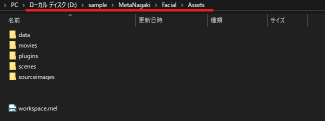
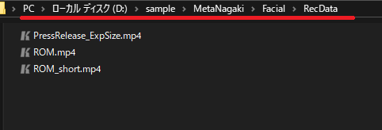


#### ②Acterの設定

「+」でactorFolderを作成するための
Create new actor folderを起動

「actor」で登録したい名前を入力
 「actor」＝モーションキャプチャアクター名
※半角英数字で入力

Create
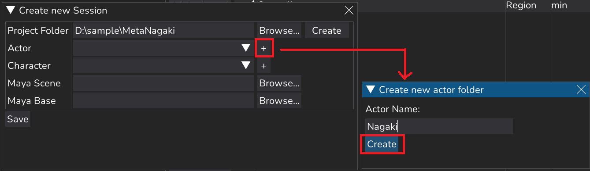

問題なく作成できたら画像のポップアップが出ます
close


エクスプローラーで
FCSフォルダ直下に入力した名前のフォルダが作成されます
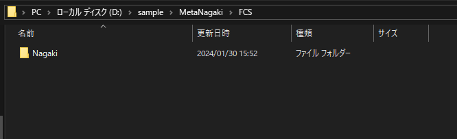


#### ③Characterの設定

「+」でcharacterFolderを作成するための
Create new characterFolderを起動
「character」で登録したい名前を入力

Create
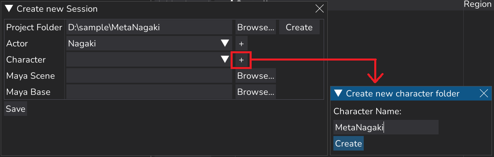

```{waning}
★Mayaシーン名に含まれていないと読み込みエラーが出ます
例：
〇　Mayaシーン「FCS_MetaHuman_prj_v04.ma」
　　character「MetaHuman」
✖　Mayaシーン「FCS_MetaHuman_prj_v04.ma」
　　character「Alexander」
```

エクスプローラーで
Actorフォルダ直下にcharacterフォルダが作成されます
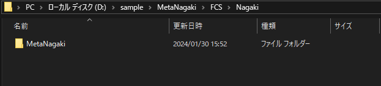


#### MayaSceneの設定

MayaSceneデータのパスを指定します
 例：
◎D:\sample\MetaNagaki\Facial\Assets\scenes\MetaNagaki.ma
×D:\FCS_テスト\MataNagaki…\MetaNagaki★テスト用.ma


#### ⑤MayaBaseの設定

workspace.melがある場所
（Mayaシーンのプロジェクト設定で登録している場所）
を指定します
 例：D:\sample\MetaNagaki\Facial\Assets
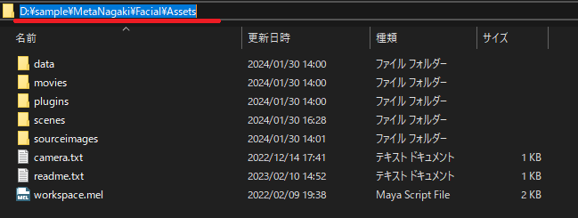


指定した場所が反映されていたら
・ Save
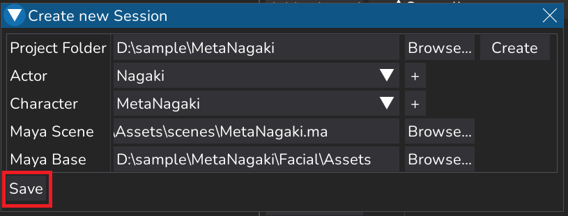

エクスプローラーで
characterフォルダ直下に
fcs_session.yaml(FCSファイル)が作成される
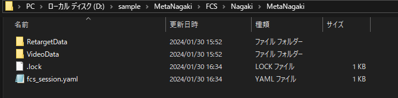

```{note}
★.lockファイルは
作業中にほかの人からのアクセスを防ぐためのもので
正常に終了した際には自動で削除されます
```

```{note}
★ 不正に終了した場合は.lockが残ってしまうため、
強制終了などで正常に終了できなかった場合は
　・FCSで起動時にポップアップでOK
　・.lockファイルをエクスプローラーで削除
```
フォルダの作成がうまくいかない場合→トラブルシューティング（へのリンク）をご確認ください

### 既にsessionが作成されている場合

・FileSession▶Open▶Open
もしくは吹き出し部分の 履歴に最近使用したsessionが表示されていれば
・FileSessionOpen該当のパス （その場合は↓の手順はなし）を選択
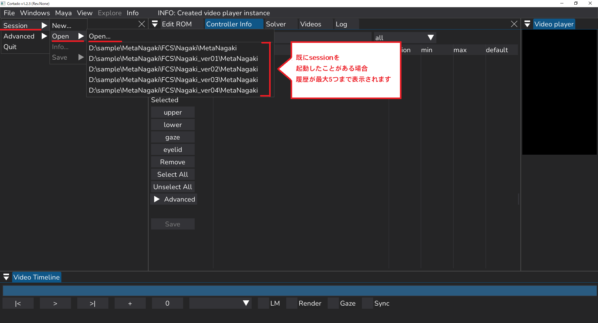

```{note}
（上記でファイルが開けた場合は↓の手順はなし）
```

・FileSession▶Open▶Open　で
　Open Sessionウィンドウが開かれたら
・Drivesを押す
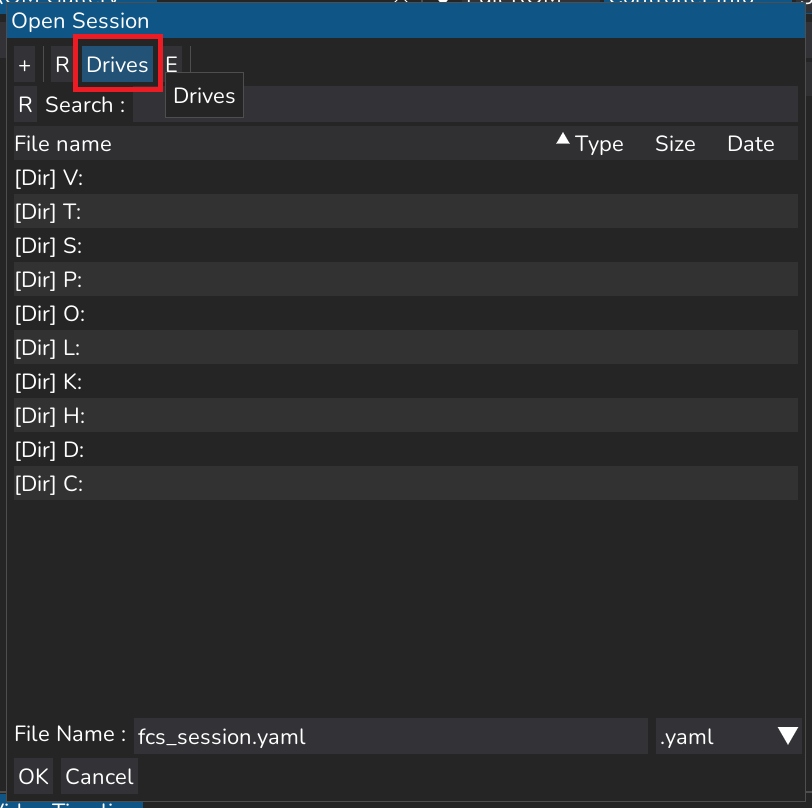

ローカルとネットワークドライブが表示されるので
・「新規作成」で作成したデータが保存されているドライブを選択
例：D:\sample\MetaNagaki…に作成した場合 [Dir]D:を選択
Dir＝Directory
・fcs_session.yaml ファイルがあるフォルダまで開き、OKを押す
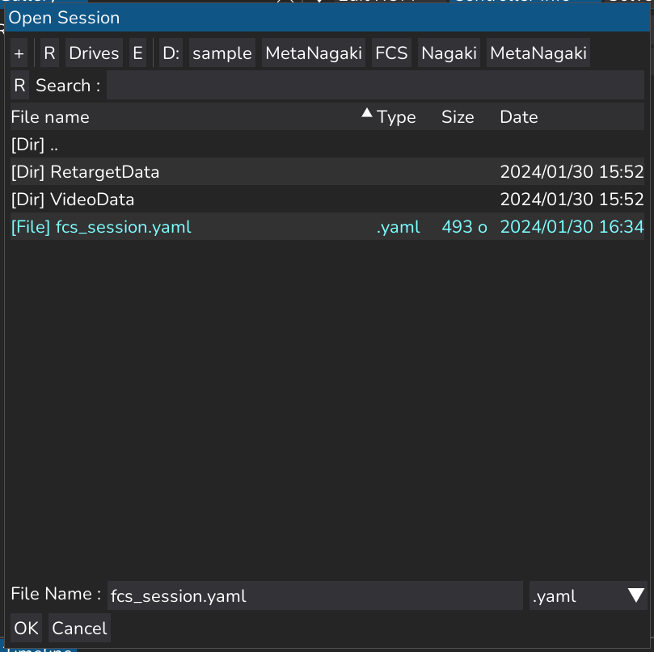

```{note}
★※FileNameの
fcs_session.yamlは 
元々入力されているので入力や選択はしなくてもOK
```
例：D:\sample\MetaNagaki\FCS\Nagaki\MetaNagaki


### seesionを開く際の注意


```{warnig}
sessionの新規作成/Open後、続けて別なsession作成や起動は出来ません
別なsessionを開きたい場合は、現在のsessionを終了し、再起動後開きなおしてください
```