## Session作成もしくはオープン
FCSではアクター情報、キャラクター情報、Mayaシーン情報とその解析データを紐づけたファイルのことを「Session」と呼びます。  

FCS起動後、Sessionデータへアクセスするため
「New...（新規作成）」または「Open（開く）」を実行します。

```{note}
初めにSessionに関わる設定を行うことで、Mayaを別途操作することなくFCS上のボタンでスムーズに作業を開始することができます。
```

### Create new Sessionで作成されるフォルダ構造
赤枠：Project Folderで作成されるフォルダ<br>
青枠：Actorで作成されるフォルダ<br>
緑枠：Characterで作成されるフォルダ<br>
.lock/fcs_session.yaml：sessionをSaveした後に作成されるファイル<br>

- Facial：動画やMayaシーンデータ等素材を保存する場所  
　- Assets：Mayaのプロジェクトファイル（Assets以下）を保存する場所  
　- RecData：ROM体操やFCSで解析したい動画を保存する場所  
　- Scene：アニメーション出力時のデフォルト出力先  
　- SetData：アニメーション出力で「audio」を選択した場合にはwavファイルが、  
　　「Frame」「Landmark Frame」を選択した場合は連番画像が作成され、保存される  

- FCS：解析に使用するデータが保存されるプロジェクトフォルダ  
　- Actor：Actorで作成したフォルダ。Actorで入力した名前が表記される  
　- Character：Characterで作成したフォルダ。Characterで入力した名前が表記される  
　- RetargetData（IMG/PARAM）：作成したProfileの編集データ（画像や数値情報）が保存される  
　- VideoData：解析する動画のキャッシュが保存される  
　- .lock：競合を防ぐためのロックファイル。起動時/終了時に自動で作成/消去される  
　-  fcs_session.yaml：session情報を保存しているファイル

### Sessionの新規作成   

 - File▶Session▶New…を選択
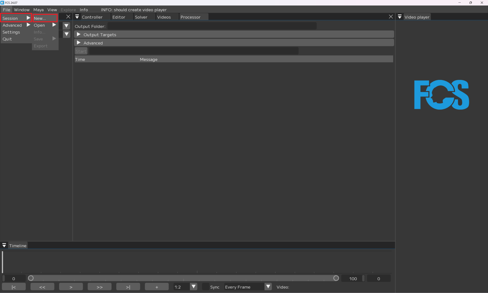

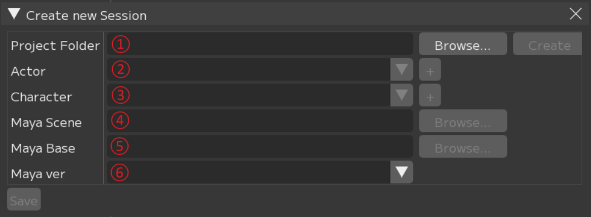  
①Project Folder：FCSの作業データを置きたい場所を指定   
②Actor：モーションキャプチャアクター名   
③Character：3Dモデルのキャラクター名  
④Maya Scene：3DモデルのMayaシーンへのパス  
⑤Maya Base：Assets、workspace.melがあるフォルダへのパス  
⑥Maya Ver：3Dモデルを作成したMayaのバージョンを指定

#### ①Project Folderの設定

Browseボタンをクリックし、Project Folderを指定するためウィンドウを起動します。  
- FCSのデータを保存したい任意のフォルダを選択
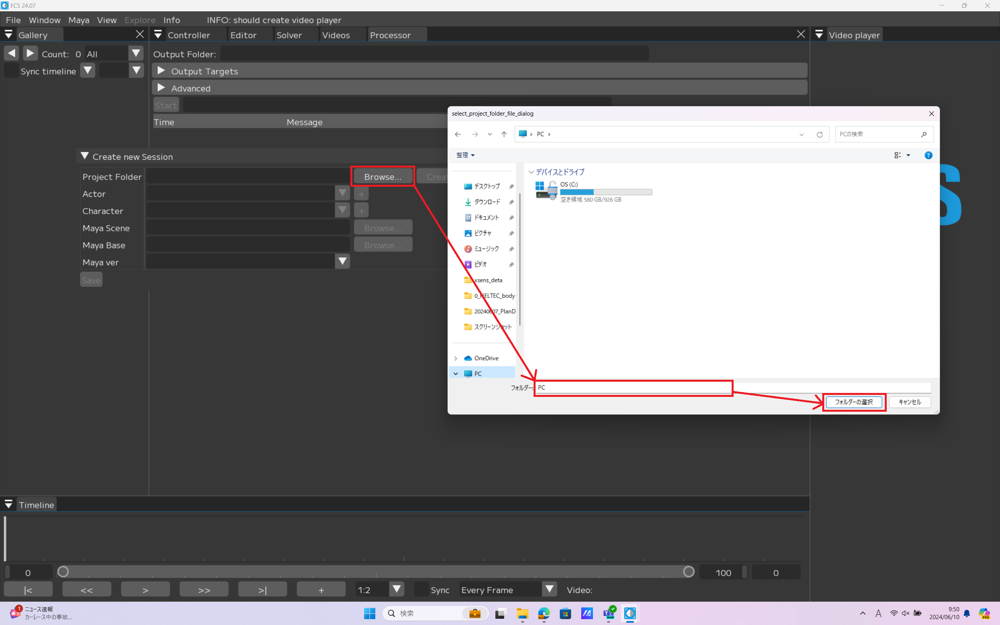

Project Folderを作成します。  
- Create

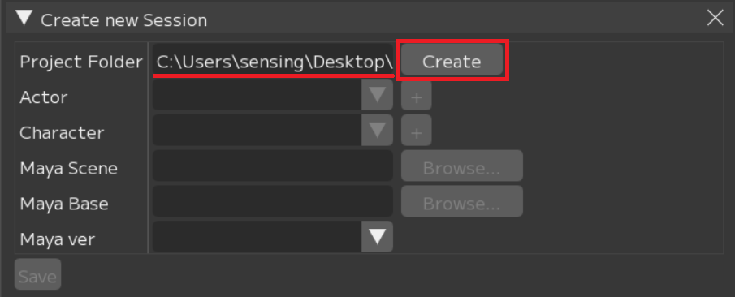

問題なく作成できたらポップアップが表示されます。  
- close
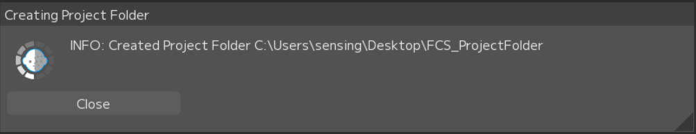

エクスプローラーで「Facial」「FCS」のフォルダが作成されます。
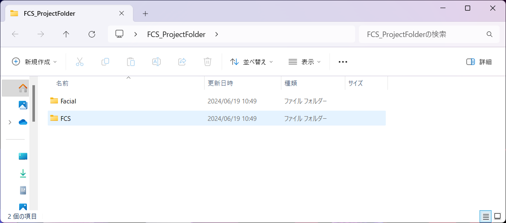

```{note}
Project Folder作成後  
 - Project Folder▶Facial▶Assetsフォルダに紐付けるMayaシーンを、  
 - Project Folder▶Facial▶Recdataフォルダに解析したい動画を移動しておくことを推奨します。  
※別の場所に保存していてもアクセスできます。
```
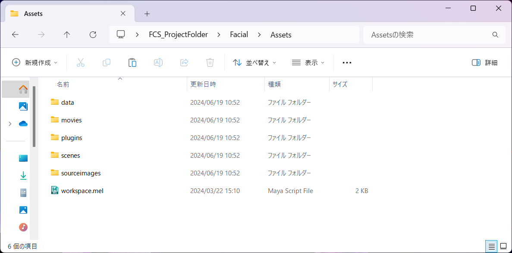

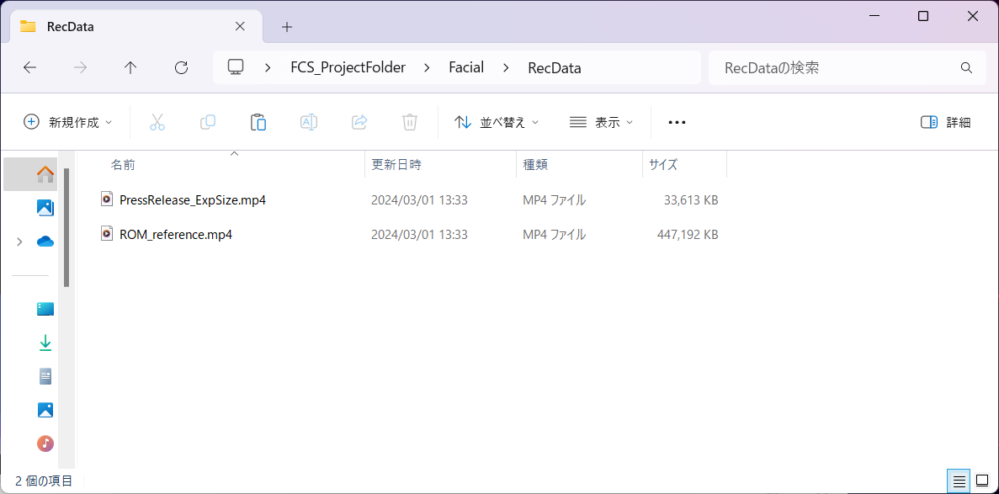


#### ②Actorの設定

「+」ボタンをクリックし、ActorFolderを作成するための 「Create new actor folder」ウィンドウを起動します。

 - 「Actor Name」に登録したい名前を入力  
 - 「Actor」＝モーションキャプチャアクター名  

 - Create
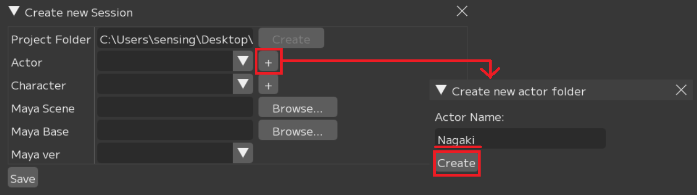

問題なく作成できたらポップアップが表示されます。  
 - close
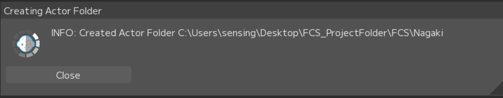

エクスプローラーでProject Folderフォルダ直下に入力したActerフォルダが作成されます。
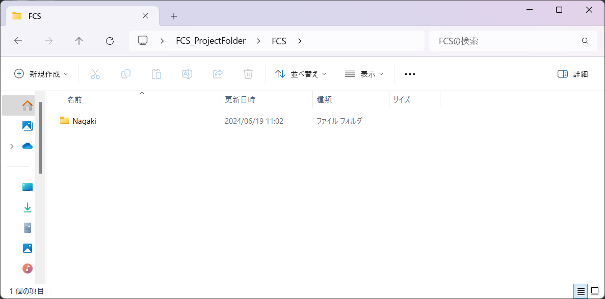


#### ③Characterの設定

「+」ボタンをクリックし、characterFolderを作成するための「Create new character Folder」ウィンドウを起動します。  
 - 「Character Name」の入力欄に登録したい名前を入力

 - Create
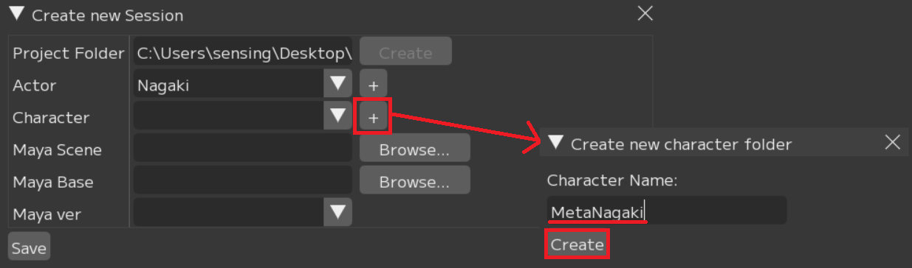

エクスプローラーでActorフォルダ直下に入力したCharacterフォルダが作成されます。
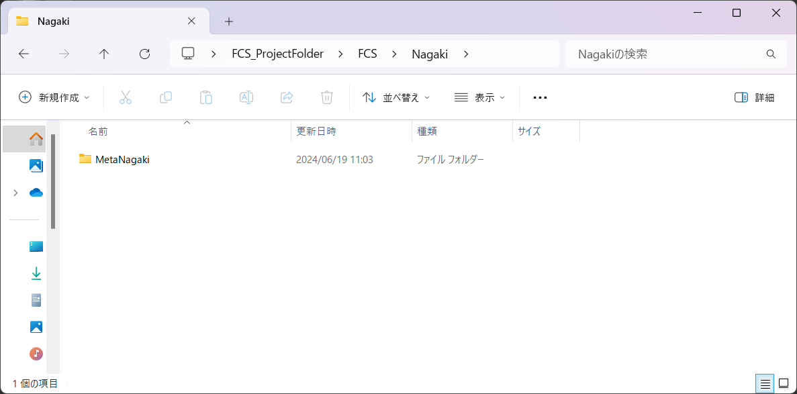


#### ④MayaSceneの設定

Browseボタンをクリックし、MayaSceneを指定するためウィンドウを起動します。  
 - MayaSceneデータのパスを指定
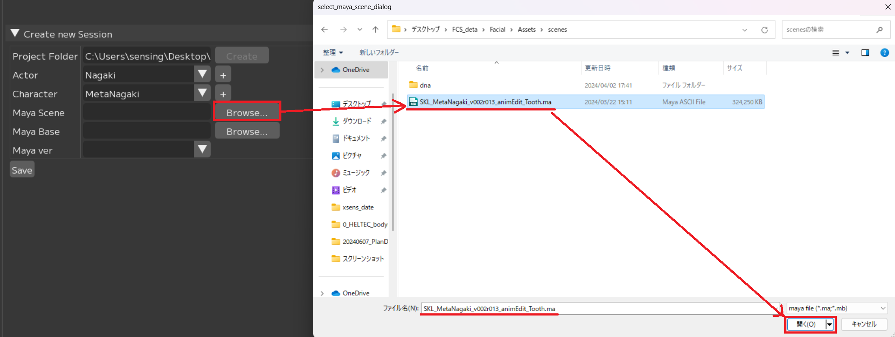


#### ⑤MayaBaseの設定

Browseボタンをクリックし、MayaBaseを指定するためウィンドウを起動します。  
 - workspace.melがある場所(Mayaシーンのプロジェクト設定で登録している場所)を指定  
```{attention}
FCS上でポップアップするウィンドウにはworkspace.melが表示されません  
``` 
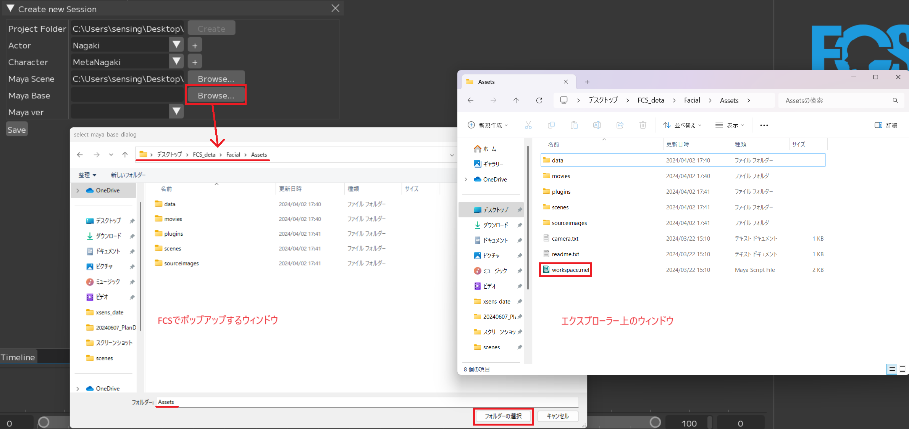


#### ⑥MayaVerの設定

 - ④で設定したsceneを作成したMayaのバージョンを指定
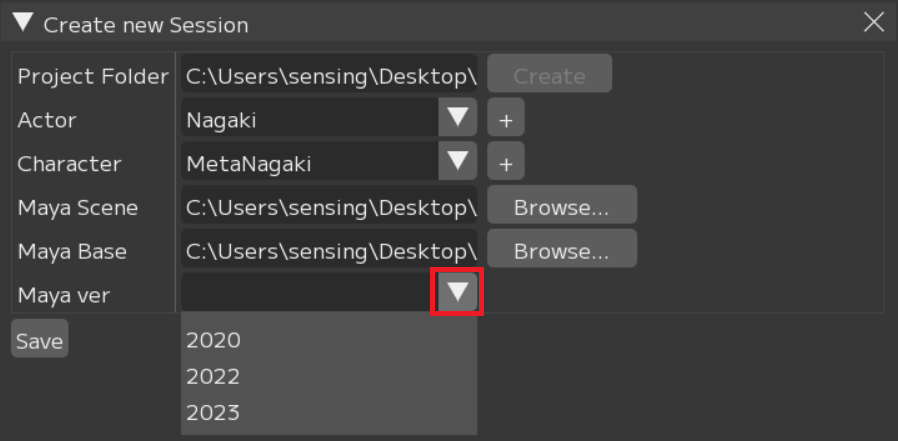

全て入力を終えたらSaveボタンを押してください。  
 - Save  
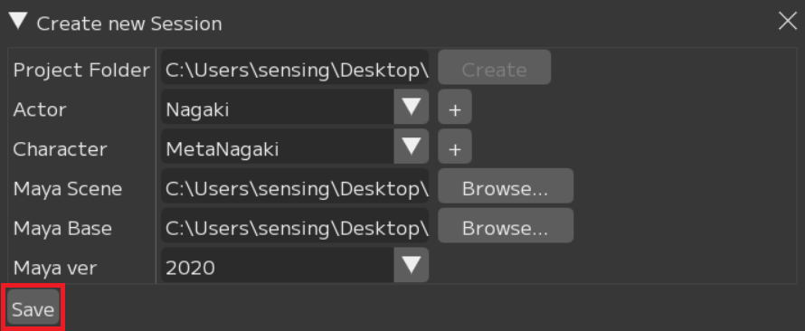


エクスプローラーでcharacterフォルダ直下にfcs_session.yaml(FCSファイル)が作成されます。  
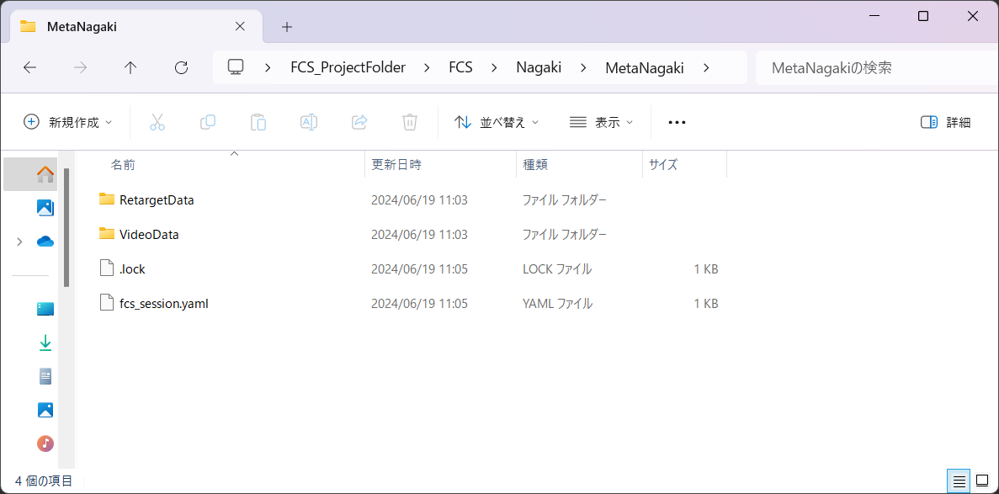

```{note}
.lockファイルは
作業中にほかの人からのアクセスを防ぐためのものです。  
正常に終了した際には自動で削除されます。
```

```{note}
不正に終了するなどして.lockファイルが残ってしまった場合、  
FCSの起動時にポップアップから削除するか、  
.lockファイルをエクスプローラーで直接削除してください。
```
<br>

### 既にSessionが作成されている場合

履歴またはfcs_session.yamlファイルからSessionを開いてください。 

#### 履歴から開く場合

以前にSessionを起動している場合、File▶Session▶Openの下に履歴が表示されます。  
 - 作業したいデータをクリック
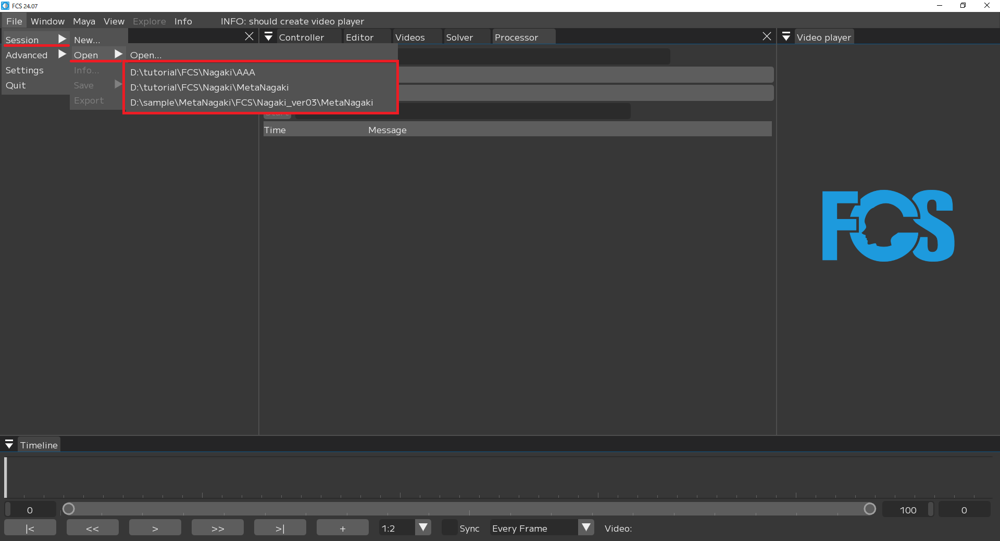

#### fcs_session.yamlファイルから開く場合

 - File▶Session▶Open▶Open...  
OpenSessionウィンドウが開かれたらローカルとネットワークドライブが表示されます。  

 - Characterフォルダ直下にあるfcs_session.yamlファイルを選択し、開く
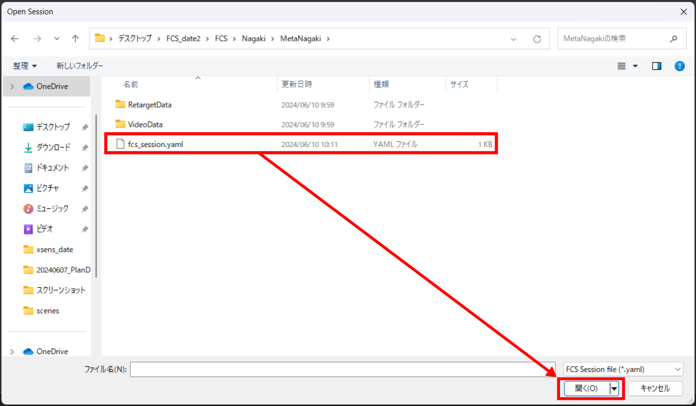

<br>

### Seesionを開く際の注意

#### Sessionの同時起動について

```{warning}
Sessionの新規作成/Open後、続けて別のSession作成や起動は出来ません。  
別のSessionを開きたい場合は、現在のSessionを終了し、FCSの再起動後開きなおしてください。
```

#### 「⑥Maya Verの設定」をしても反映されない場合

session作成時に設定した項目は File▶Session▶info で確認することができます。
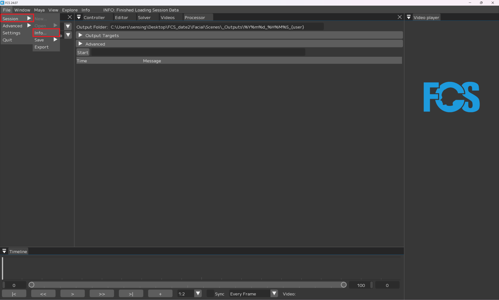

NewSessionで設定したMayaVerがinfoで反映されていない場合は、info画面のMayaVersionを右クリックし、Editから変更ができます。
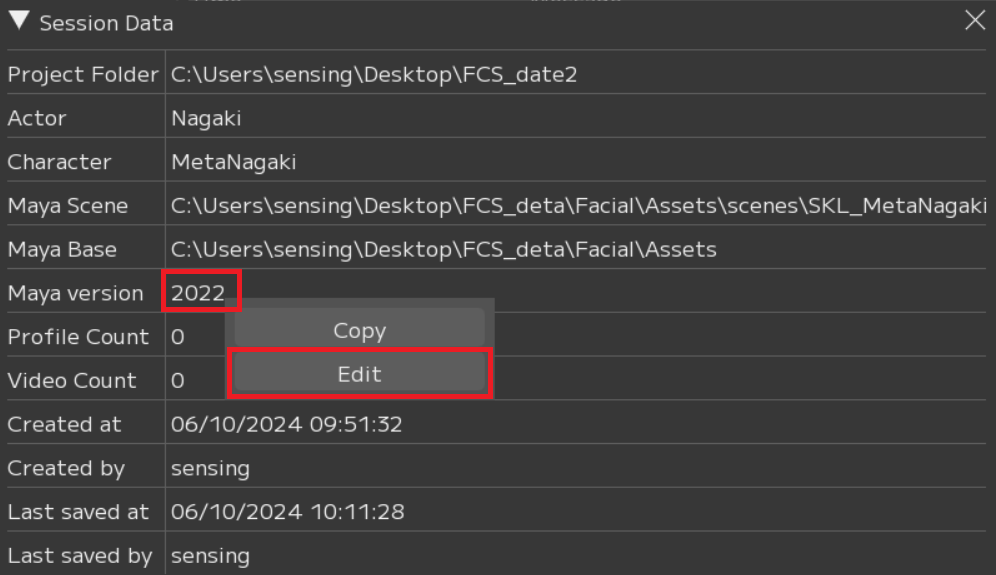
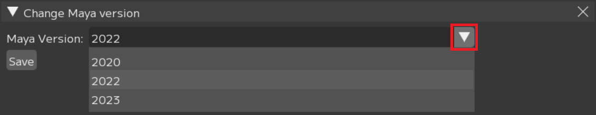

```{attention}
設定の変更後は必ずSaveボタンを押してください
```
