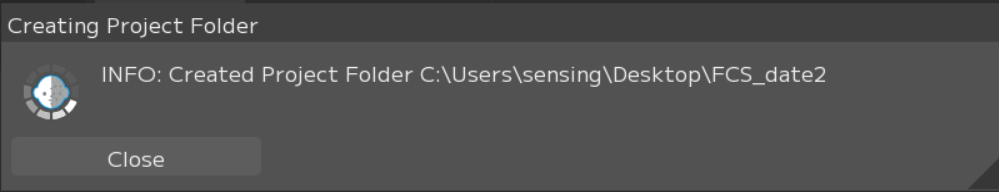
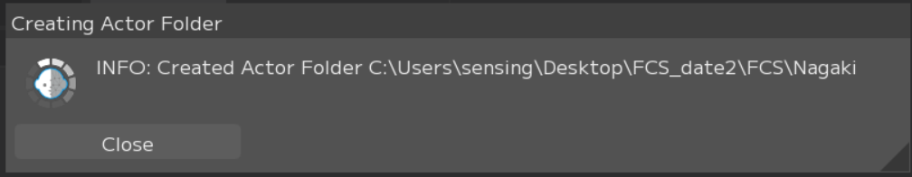
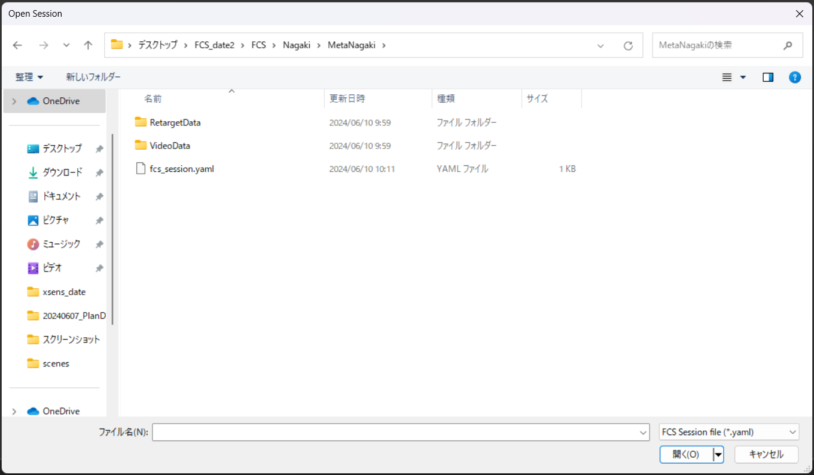

## Session作成もしくはオープン
FCS起動後、「session」と呼ばれるプロジェクトファイルにアクセスするため
「New...（新規作成）またはOpen（開く）」を実行します。

```{note}
ここでsessionに関わる設定を行うことで、Mayaを別途操作することなくFCS上のボタンでスムーズに作業を開始することができます。
```

### Create new Sessionで作成されるフォルダ構造
赤枠：Project Folderで作成されるフォルダ
青枠：Actorで作成されるフォルダ
緑枠：Characterで作成されるフォルダ
.lock/fcs_session.yaml：sessionをSaveした後に作成されるファイル


📁Facial：動画やMayaシーンデータ等素材を保存する場所  
　📁Assets：Mayaのプロジェクトファイル（Assets以下）を保存する場所。  
　📁RecData：FCSで解析したい動画を保存する場所。  
　📁Scene：アニメーション出力時のデフォルト出力先。  
　📁SetData：アニメーション出力で「audio」を選択した場合にはwavファイルが、  
　　　　　　「Frame」「Landmark Frame」を選択した場合は連番画像が作成され、保存される。  

📁FCS：解析に使用するデータが保存されるプロジェクトフォルダ。  
　📁Actor：Actorで作成したフォルダ。Actorで入力した名前が表記される。  
　📁Character：Characterで作成したフォルダ。Characterで入力した名前が表記される。  
　📁RetargetData（IMG/PARAM）：作成したProfileの編集データ（画像や数値情報）が保存される  
　📁VideoData：解析する動画のキャッシュが保存される  
　📄.lock：競合を防ぐためのロックファイル。起動時/終了時に自動で作成/消去される。  
　📄 fcs_session.yaml：session情報を保存しているファイル

### sessionの新規作成   


File▶Session▶New…を選択

  
①Project Folder：FCSの作業データを置きたい場所を指定   
②Actor：モーションキャプチャアクター名   
③character：3Dモデルのキャラクター名  
④Maya scene：3DモデルのMayaシーンへのパス  
⑤Maya Base：Assets、workspace.melがあるフォルダへのパス  
⑥Maya Ver：sceneで指定したデータを作成したバージョンを指定

#### ①Project Folderの設定

Browseボタンで
FCSの作業データフォルダを格納する場所  
＝Project Folder
を指定するためウィンドウを起動  
Driveボタンで作業者PC環境のローカルネットワークドライブを表示  
Project Folderを作成したい場所を選択したら  
フォルダーを選択


Project Folderに指定した場所が反映されていたら  
Create


問題なく作成できたら画像のポップアップが出ます


エクスプローラーで
「Facial」「FCS」のフォルダが作成されます


```{note}
★Project Folder作成後
・AssetsフォルダへMayaのデータ
・RecDataフォルダへ解析に使用する動画素材を移動しておくことを推奨します  
※別の場所に保存していてもアクセスできます
```


#### ②Acterの設定

「+」でactorFolderを作成するための
Create new actor folderを起動

「actor」で登録したい名前を入力
「actor」＝モーションキャプチャアクター名  

```{warning}
※半角英数字で入力
```

Create


問題なく作成できたら画像のポップアップが出ます  
close


エクスプローラーで
FCSフォルダ直下に入力した名前のフォルダが作成されます


#### ③Characterの設定

「+」でcharacterFolderを作成するための
Create new characterFolderを起動
「character」で登録したい名前を入力

Create


```{warning}
★④で指定するMayaシーン名に含まれていないと読み込みエラーが出ます  
例：
〇　Mayaシーン「FCS_MetaHuman_prj_v04.ma」  
　　character「MetaHuman」  
✖　Mayaシーン「FCS_MetaHuman_prj_v04.ma」  
　　character「Alexander」
```

エクスプローラーで
Actorフォルダ直下にcharacterフォルダが作成されます


#### ④MayaSceneの設定

MayaSceneデータのパスを指定します

```{warning}
★半角英数字のみのファイル名でないとエラーになります  
例：  
〇　D:\sample\MetaNagaki\Facial\Assets\scenes\MetaNagaki.ma  
✖　D:\FCS_テスト\MataNagaki…\MetaNagaki★テスト用.ma  
```


#### ⑤MayaBaseの設定

workspace.melがある場所(Mayaシーンのプロジェクト設定で登録している場所)を指定します  
```{warning}
FCS上でポップアップするウィンドウにはworkspace.melが表示されません  
```
例：D:\sample\MetaNagaki\Facial\Assets  


#### ⑥Maya Verの設定

④で設定したsceneを作成したMayaのバージョンを指定


指定した場所が反映されていたら  
Save  


エクスプローラーでcharacterフォルダ直下に  
fcs_session.yaml(FCSファイル)が作成される  


```{note}
★.lockファイルは
作業中にほかの人からのアクセスを防ぐためのもので
正常に終了した際には自動で削除されます
```

```{note}
★ 不正に終了した場合は.lockが残ってしまうため、
　　強制終了などで正常に終了できなかった場合は
　・FCSで起動時にポップアップでOK
　・.lockファイルをエクスプローラーで削除
```

### 既にsessionが作成されている場合

・FileSession▶Open▶Open
もしくは吹き出し部分の 履歴に最近使用したsessionが表示されていれば  
FileSessionOpen該当のパス （その場合は↓の手順はなし）を選択


```{note}
（上記でファイルが開けた場合は↓の手順はなし）
```

・File▶Session▶Open▶Openで  
Open Sessionウィンドウが開かれたら  
ローカルとネットワークドライブが表示されるので  

・fcs_session.yaml ファイルがあるフォルダまで開き、開くを押す


```{note}
★※FileNameの fcs_session.yaml は 
元々入力されているので入力や選択はしなくてもOK  
例：D:\sample\MetaNagaki\FCS\Nagaki\MetaNagaki
```

### seesionを開く際の注意

#### sessionの同時起動について

```{warning}
sessionの新規作成/Open後、続けて別のsession作成や起動は出来ません  
別のsessionを開きたい場合は、現在のsessionを終了し、再起動後開きなおしてください
```

#### ⑥Maya Verの設定をしても反映されない場合

session作成時に設定した項目は File▶Session▶info で確認することができます  


New Sessionで設定したMaya Verがinfoで反映されていない場合は、info画面のMaya versionを右クリックし、Editから変更ができます


