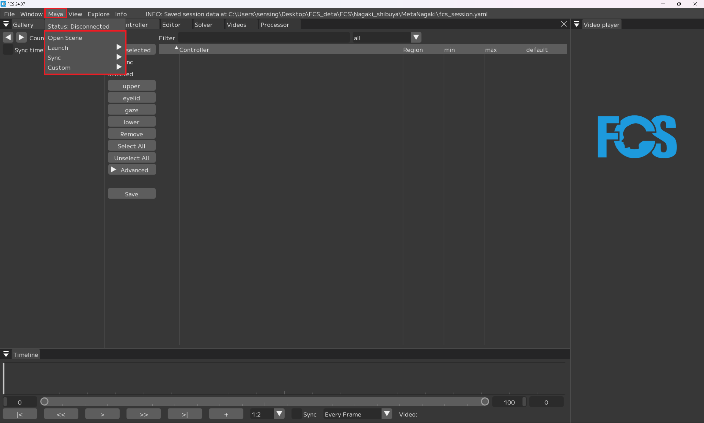
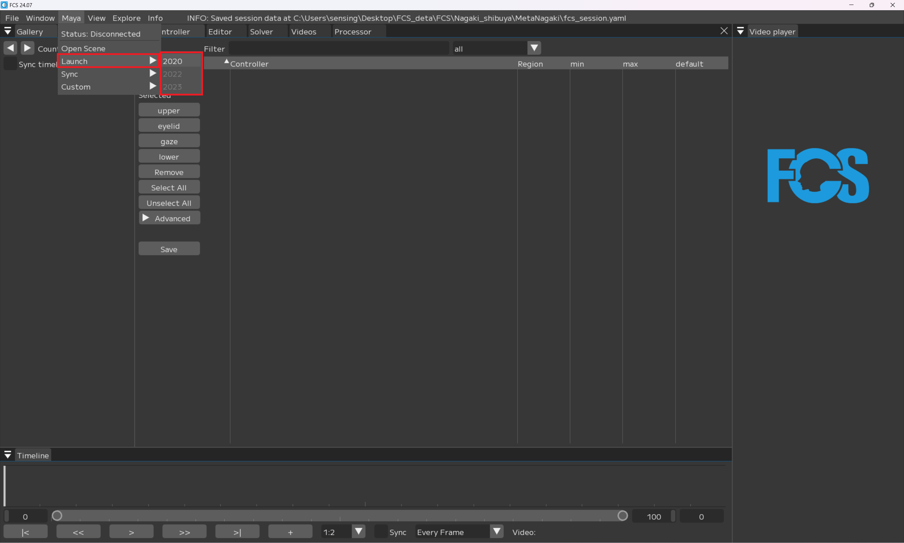

## Mayaの起動  

```{warning}
FCSとMayaを接続するためには、必ずFCSのメニューからMayaを起動する必要があります。  
```

  
OpenScene：Mayaシーンを起動  
Launch：Mayaを起動   
Sync：✅Mayaと連動させる   


・Maya▶Launch▶Mayaバージョンの選択でMayaを起動  
例：マニュアルでキャラクターデータを作成したMayaのバージョンはMaya2020なので2020を選択しています。


```{note}
・Launchをクリックすることでsession作成時に設定したMayaSceneが自動で起動します。  
・OpenSceneをクリックすると、設定したMayaSceneを開き直すことができます。  
・Mayaバージョンの誤クリックを防ぐため、Session作成時に設定したMayaVersion以外はクリックできないように、ブラックアウトしています。
```

  
### Launchで指定したMayaバージョンが開けない場合  

session作成時に設定した項目は File▶Session▶info で確認することができます。  


New Sessionで設定したMaya Verがinfoで反映されていない場合は、info画面のMayaVersionを右クリックし、Editから変更ができます。


  
```{note}
設定の変更後は必ずSaveボタンを押してください
```
