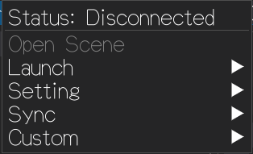
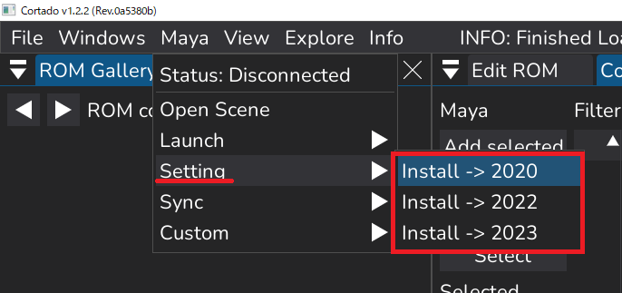
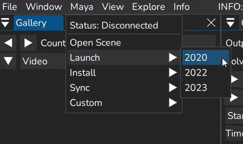
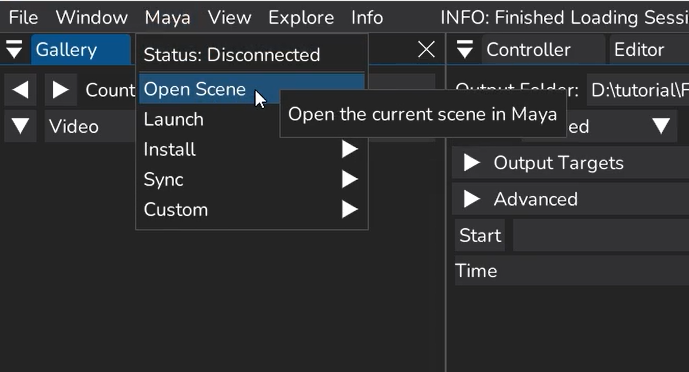
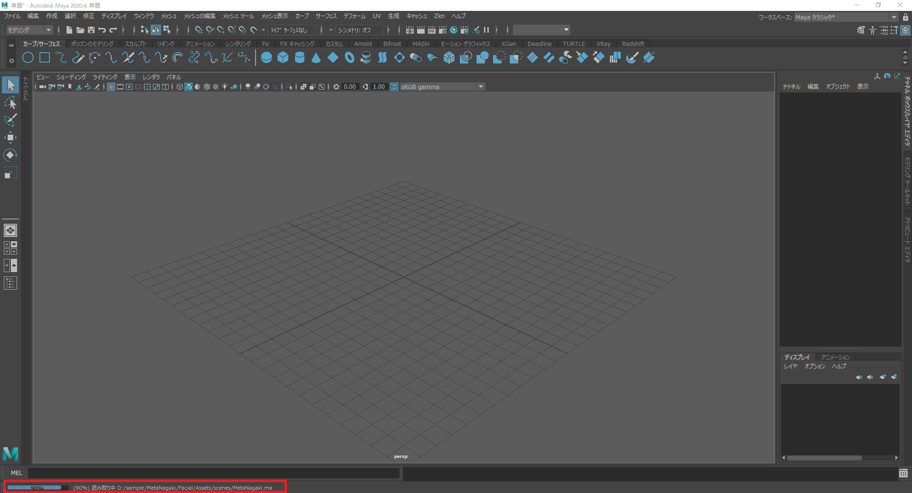
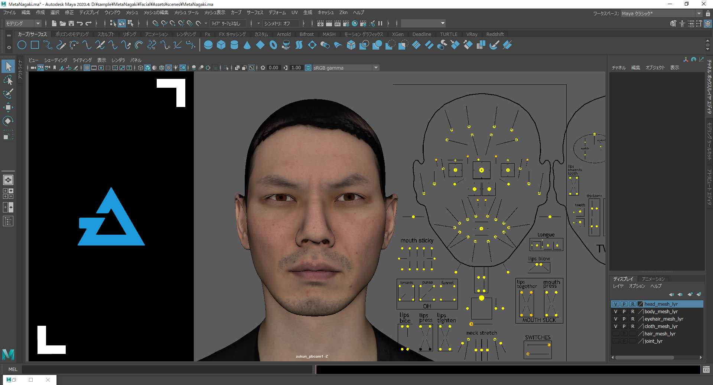

## Mayaの起動

・初回起動時のモジュールのインストール
・FCS起動時にMayaを起動/別作業を行っていた場合は終了させるを実行後、FCSからMayaを起動します。

```{warning}
※上記作業を実行しなかった場合、正常に動作しない可能性があります。
```


OpenScene：Mayaシーンを起動
Launch：Mayaを起動
Setting：モジュールのインストール
Sync：✅Mayaと連動させる

【モジュールのインストール】
・Maya▶Setting▶Install→(Mayaバージョン)
インストール後、Mayaを起動します。


```{note}
★別バージョンを起動する際には、バージョンに適したモジュールのインストールが必要になります。
例：
◎2020インストール→2020起動
×2020インストール→2023起動
⇒2023インストール→2023起動
```


【モジュールのインストール後】
・Maya▶Launch Maya▶（Mayaバージョン）でMayaを起動
例：D:\sample\MetaNagaki\Facial\Assets\scenes\MetaNagaki.maのバージョンはMaya2020なので2020を選択


Mayaが開いたら
・Maya▶Open Sceneで登録したMayaシーンを開きます



OpenSceneを押すと
・Maya側でシーンを起動する際の読み込みが発生するので待機
※データの重さによって読み込み時間は変動します


読み込み完了後
create sessionで指定した Maya sceneが開かれます


