## Profileの作成

### Profileの作成の前に...
・解析したい動画を Facial\RecDataフォルダに移動する  


```{note}
★デフォルトでは create sessionで作成されたProject Folderが開かれるので  
Facial\RecDataフォルダに解析したい動画を保存しておくことを推奨します （必須ではありません）
```

#### 解析動画を開く方法

・Window▶Videosで解析したいウィンドウを表示します
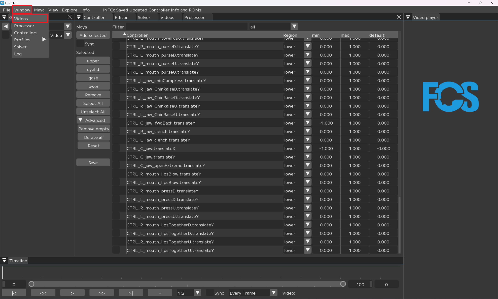

・import
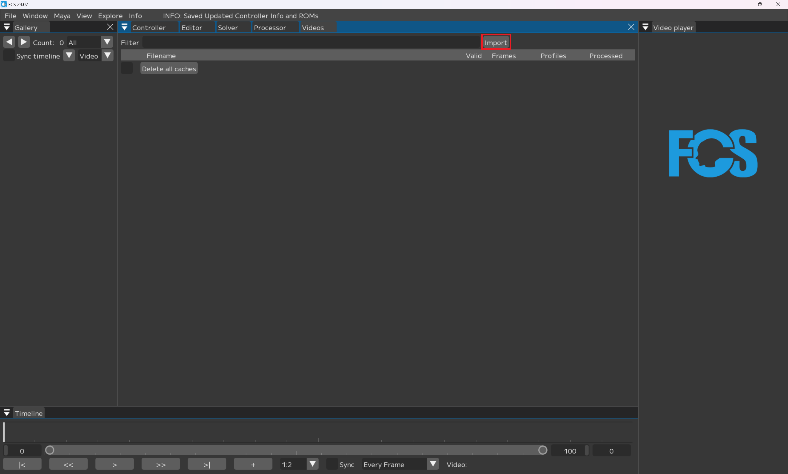

ウィンドウがポップアップされるので  
・解析したい動画をクリックし開く
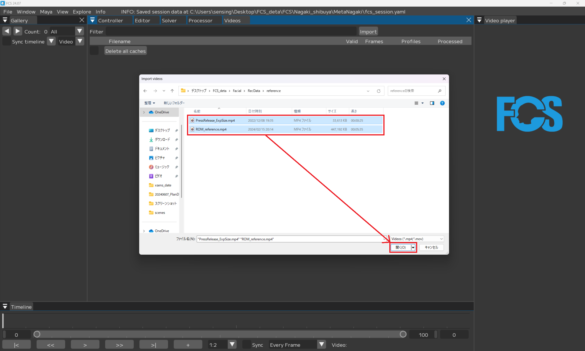

```{note}
★Shift+クリックで複数同時にimportできます
```

Videosウィンドウに解析したい動画が表示されます
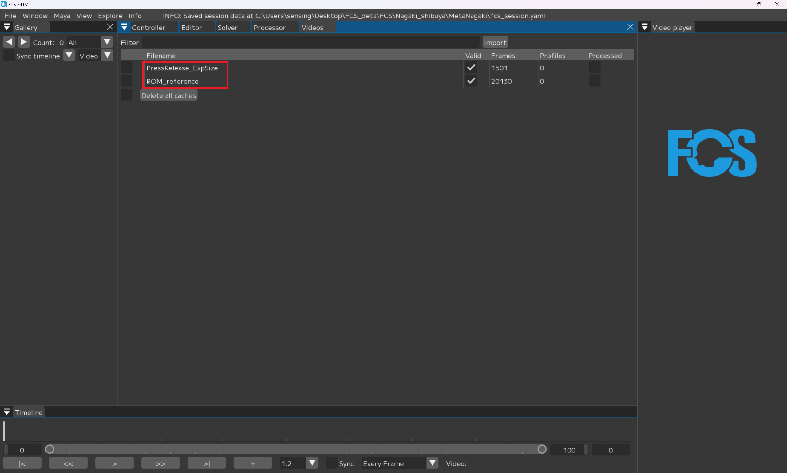

#### Timelineの画面説明

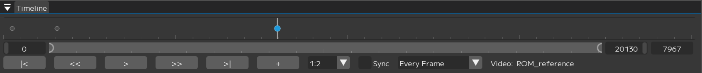
- Timeline：バーを左右に動かし、ビデオを手動で再生させる
- ＞：動画の再生・停止をする
- |＜/＞|：1フレーム前/次に移動する
- ≪/≫：動画再生/一時停止（再生すると一時停止ボタンが表示される）
- +：現在のフレームのデータをGalleryに追加する。
- [0]：現在のフレーム数。ダブルクリックで数値入力が可能。指定のフレームへの移動も可能。
- Sync：✅でTimeline操作状況をMayaのTimeSliderと一致させる。
- Scale：が小さくなるほどプレビューが鮮明に、が大きくなるほど荒くなります
- Video：Video playerに表示されている動画名

#### Editorの画面説明

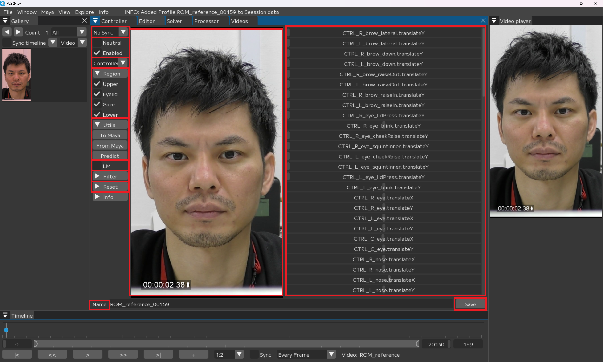
No Sync▼
- To Maya：FCSをMayaと連動させる
- From Maya at save：MayaをFCSに連動させる
- Both：FCSとMayaを双方向で連動させる
- No Sync：FCSとMayaを連動させない

```{note}
本ページではProfileの追加手順・編集手順について記載しております  
Mayaをベースに表情を調整するのか、FCSをベースに表情を調整するのかは任意で使い分けることができますが、  
最初は「Both」での使用をオススメします
```

Neutral：✅デフォルトの表情として必ず1つ登録する。  
Enabled：✅解析する素材として使用する/□使用しない  

Controller▼
- Controller：コントローラー表示が名前になる
- Value：コントローラー表示が数字になる 

▼Region
- Upper/Eyelid/Gaze/Lower：✅調整した情報を登録する  

▼Utils
- To Maya：FCS上で操作した値（情報）をMayaへ送る
- From Maya：Mayaで操作した値（情報）をFCSへ送る
- Predict：画像から表情を解析し　Mayaの3Dモデルに反映する機能

LM：LandMark（部位の頂点情報）を表示する  

▼Filter
- ▼all/Upper/Eyelid/Gaze/Lower：選択した項目でコントローラーを絞り込む
- [ ]：入力した文字でコントローラーを絞り込む  

▼Reset：入力した情報を削除する

Name：Profileとして登録する名前

Save：変更した情報を保存する

画像部分：Timelineから+で追加した画像（ GalleryからEditしたもの）が表示される

コントローラー（画像右側）：Controller Infoで登録したコントローラーが表示される

#### Galleryの画面説明

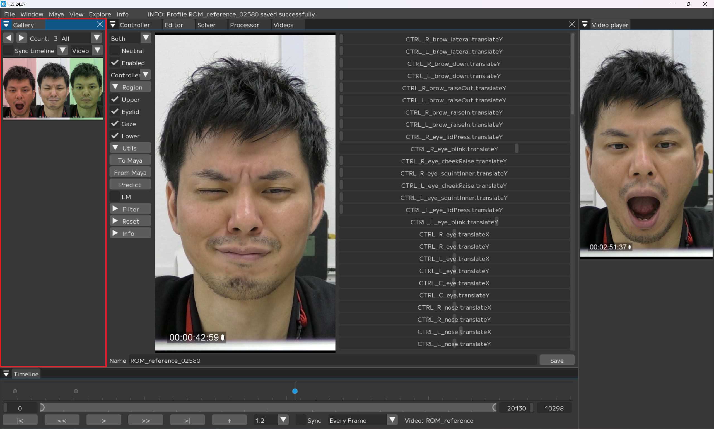
作成したProfileが表示されるウィンドウ  
- 緑：Neutralで登録したprofile
- 赤：登録（save）していないprofile
- 白：登録（save）済のprofile


### Profileの作成

様々な表示のprofileを追加することで解析の精度が上がっていきます。  
単純に数が多ければ良いわけではなく、似た表情のprofileに対し、コントローラーの数字が違ってしまった場合、ノイズになってしまうため注意が必要です
```{note}
ROM体操と呼ばれる約50個のprofileの作成をオススメしています
ROM体操の表情については、スターターキットをご参照ください
```

#### 解析したい動画の読み込み方法  

・開いた動画(ファイル名)の上で右クリックし  
・Open
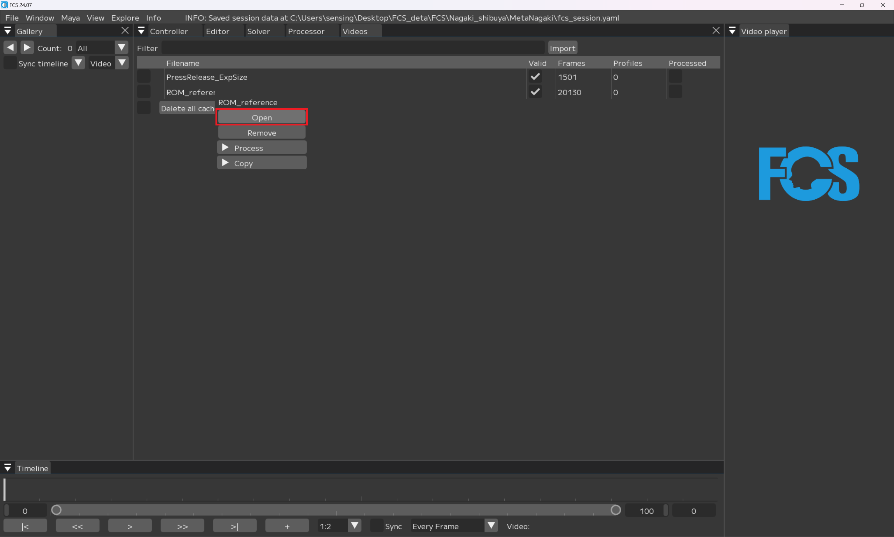

Video playerに動画が表示される
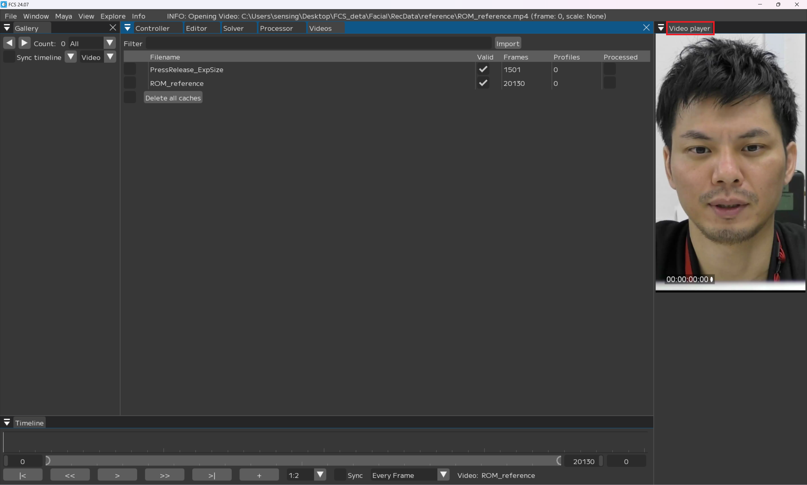

#### Profileの追加方法

VideoTimelineウィンドウの  
・スライダーを動かし表情の登録を行いたいフレームで止め  
・+を押す  
・Galleryに指定したフレームの画像が追加される
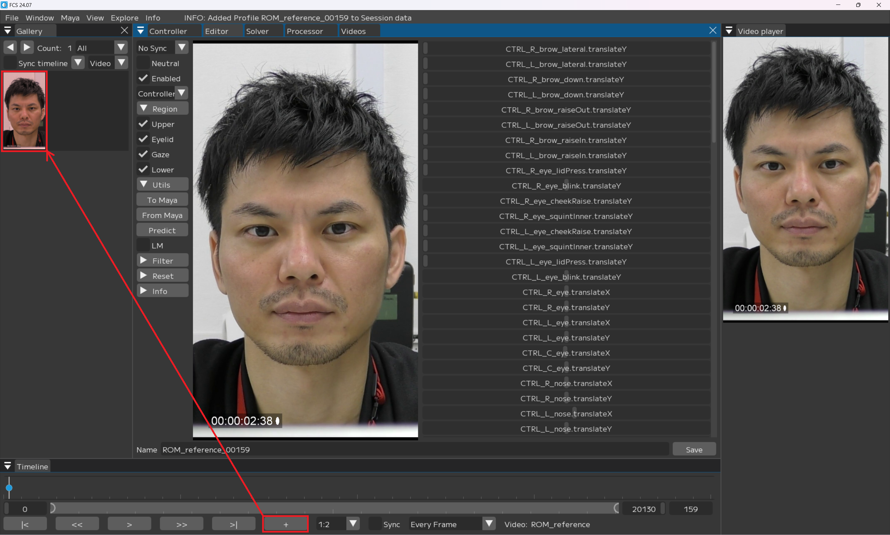

```{note}
★ 値が0（未登録）のProfileは赤枠
```

#### Neutralの表情の登録

Profile作成の一番初めにアクターの自然な表情とキャラクターの自然な表情を登録します

Neutral＝3Dモデルのデフォルトの表情なので数値の変更は行わず  
・Neutralに✅  
・任意の名前に変更し  
・Save
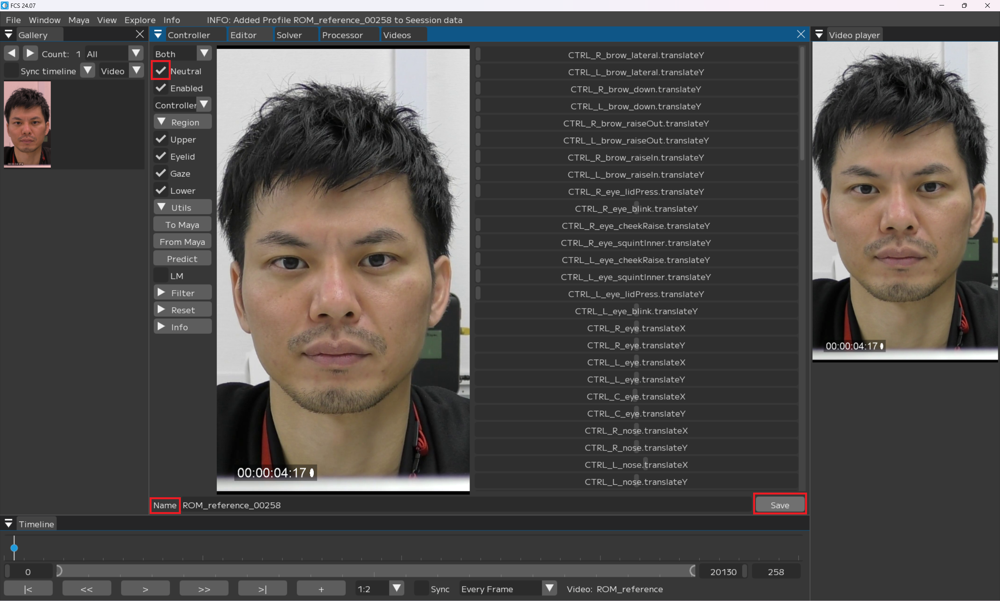

```{note}
★ Neutralの登録が完了すると緑になります
```
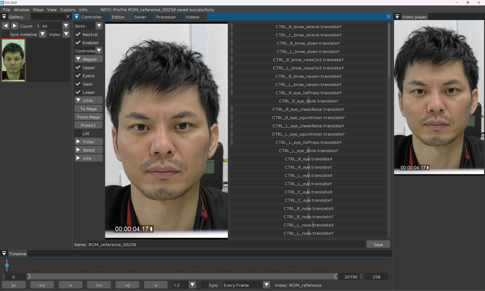

#### Mayaで表情を調整する場合

VideoTimelineウィンドウのスライダーを動かし表情の登録を行いたいフレームで止め+を押す  
Galleryに指定したフレームの画像が追加される

```{note}
★ 値が0（未登録）のProfileは赤枠
```
追加した赤色の画像をクリックし、  
Editor画面に表示されている画像が同じであることを確認
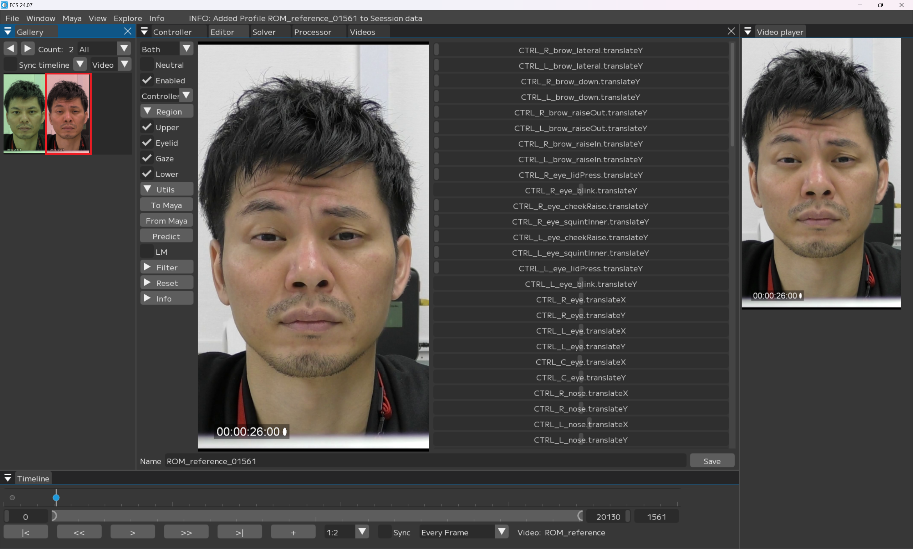

・Mayaのコントローラーリグで追加したアクターの表情と同じになるようにキャラクターの表情を調節し


・From MayaでMaya上で調整した値を抽出

Mayaでの調整情報がFCSに反映される

```{note}
★Syncのプルダウンで「From Maya at save」もしくは「Both」にしている場合は、  
　調整した数値が自動で同期されます。
```

```{note}
★コントローラーの登録忘れがあった場合は再度開いたときに作成した表情と異なる場合があります
　その際は、再度登録し忘れたコントローラーを登録しプロファイルの再登録を行ってください
```
 
・Nameを任意の名前に変更し
・Save
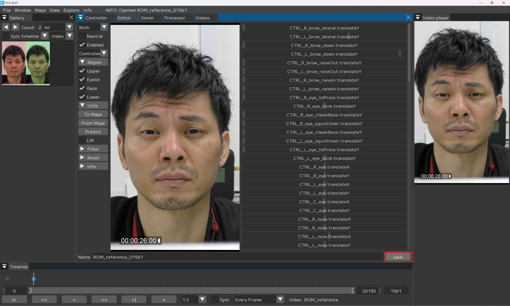
```{note}
★名前は必ずしも変更する必要はありません。
```

```{warning}
Neutral以外の表情の場合はNeutralの✅をはずす
```

#### FCS上で表情を調整する場合

VideoTimelineウィンドウのスライダーを動かし表情の登録を行いたいフレームで止め+を押す  
Galleryに指定したフレームの画像が追加される

```{note}
★ 値が0（未登録）のProfileは赤枠
```
追加した赤色の画像をクリックし、  
Editor画面に表示されている画像が同じであることを確認


```{warning}
Syncが「No Sync」の場合はProfileの自動情報共有が行われないためMaya上は1つ前に登録した表情のままになっている
```


```{note}
★Syncを「Both」にした状態で開きなおすと デフォルトの表情(登録されている表情)になる  
★既にしている場合はスキップ
```
・FCSで登録したコントローラーを調整し、
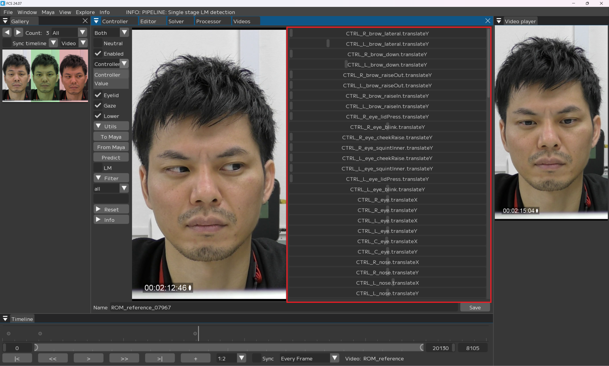

・To Mayaで現在のProfileの数値情報をMayaに送る
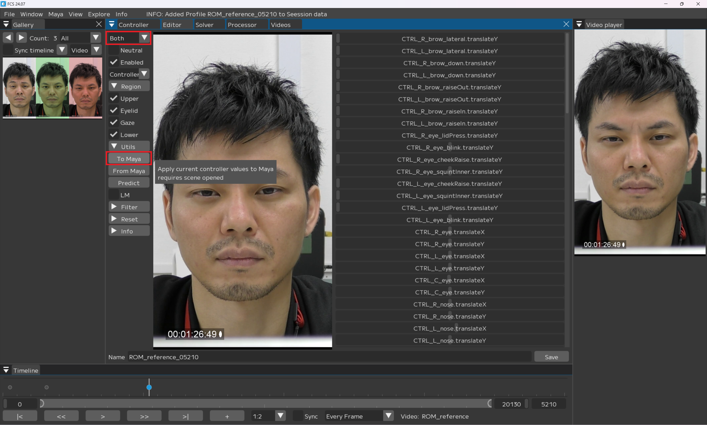

```{note}
★Syncのプルダウンで「To Maya」もしくは「Both」にしている場合は、  
　調整した数値が自動で同期されます。
```

FCSで調整した内容がMayaに反映される
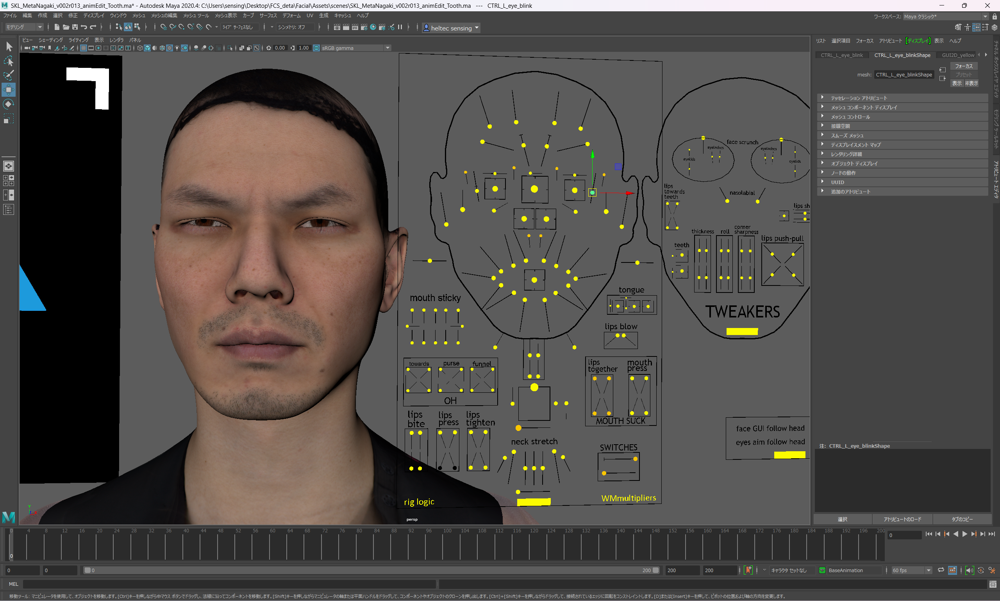

```{note}
絞り込みたい項目（文字含む）のみ表示されるようにするには…
▼Filterから搾りたい項目をクリック
```
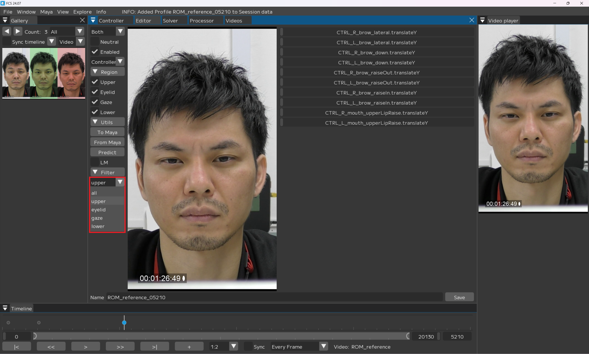


#### PredictでProfileを作成する場合

本ソフトでは、作成したProfileから自動でリターゲットをしてくる  
Predict機能を搭載しています  
ある程度のProfileを登録した後で、追加のProfileを登録する際にPredict機能を使えば、  
登録済のProfileを基に、ソフトが予想した表情を作成してくれます

```{warning}
Predictで自動リターゲットする精度は、登録済のProfileの精度と連動します  
また、動画全体を解析するわけではないので注意が必要です
```

VideoTimelineウィンドウのスライダーを動かし表情の登録を行いたいフレームで止め+を押す  
Galleryに指定したフレームの画像が追加される

```{note}
★ 値が0（未登録）のProfileは赤枠
```

追加した赤色の画像をクリックし、  
Editor画面に表示されている画像が同じであることを確認


・Predict実行  
valueの数値が変動し
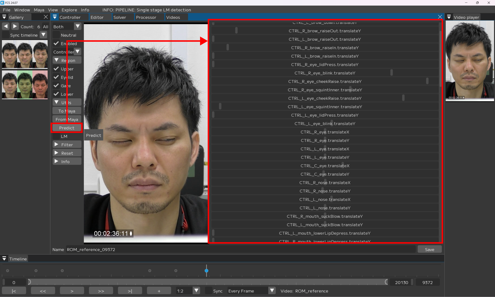

MayaにPredict結果が出る  
調整し、登録できる内容になったら
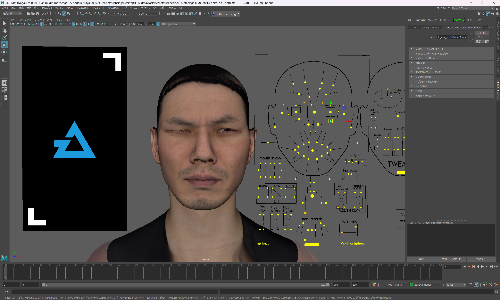

・Save
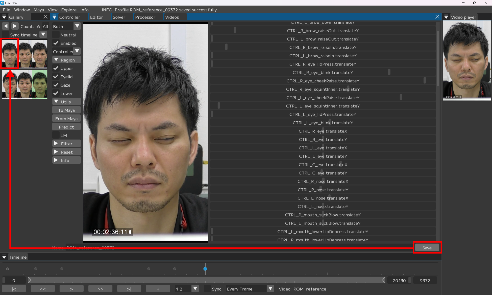


### Profileを作成するときの注意点

Profileを作成する際に、例えばupperのコントローラーのみを調整した場合、Regionをupperのみで登録することをおすすめします。

```{warning}
目を閉じる、薄目のプロファイルで黒目が見えないものは登録する際にGazeの✅を外してください  
解析結果の精度が低下してしまう可能性があります  

顔を登録する際に  
upper/eyelid/gaze/lowerの4つのRegionで使用していないコントローラーの登録を外すことで解析時のノイズを減らすことができます
```

例：眉のぎゅっと絞る動きを作りたい


表情を調整した上で
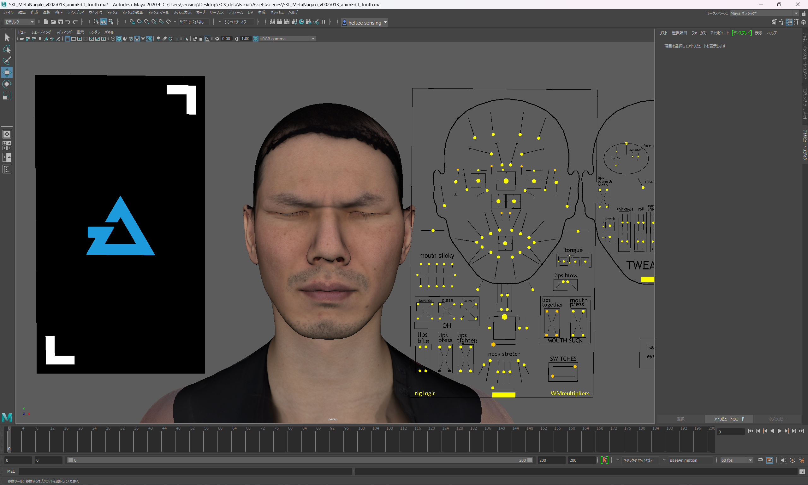

Regionのgaze/lowerの✅を外す
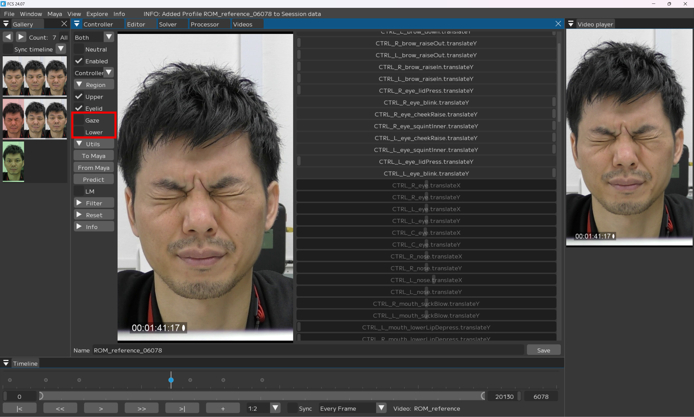

Save

### トラブルシューティング

#### ＋キーを押してもGalleryにProfileが追加されない場合
＋キーを押してもGalleryにProfileが追加されない場合  
Galleryの表示ウィンドウが小さいケースが考えられます。
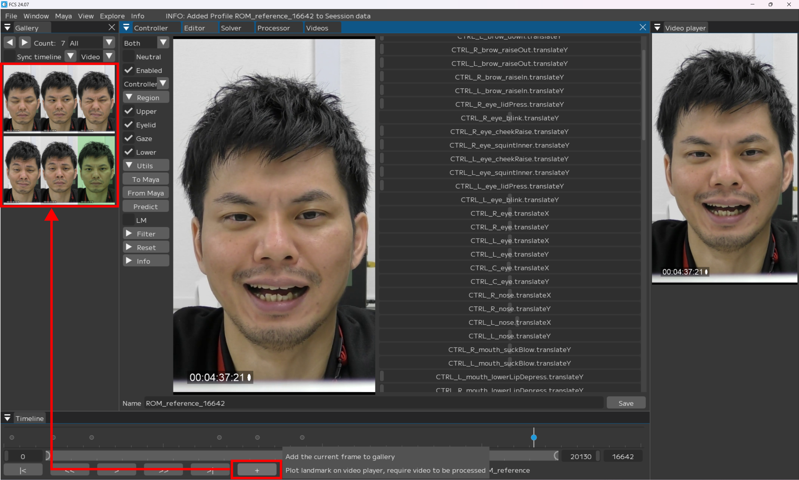

その場合は、Galleryウィンドウの◀▶をクリックすると追加したprofileが表示されます。


```{note}
FCSでは同一フレームのprofileは重複で追加されないようになっています。  
重複した場合、Logウィンドウで  
WARNIG:Frame ○○ already has a Profile associated with it  
と表示されます。  
```
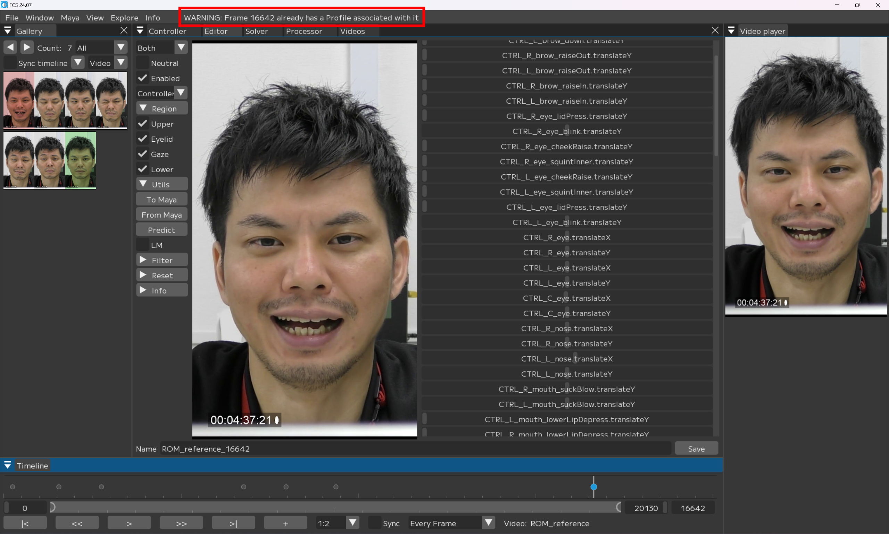