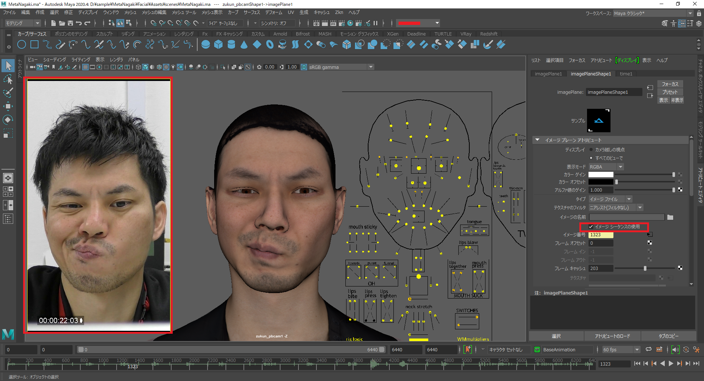

## アニメーションの出力方法

### 単体のアニメーション出力

#### 出力画面説明


▼Process  

✅Reprocess：作成したProfile情報を読み取る  
```{note}
基本的に✅を付けることをオススメします。
```

Upload Options
- ✅Animation：アニメーションデータを生成、Mayaに反映  
- ✅Audio：解析する動画の音声データをMayaに反映  
- ✅Frames：解析する動画の連番画像を生成、Mayaのイメージプレーン上に反映  
- ✅Landmark Frames：顔の動きをオートトラッキングする連番画像を生成、Mayaのイメージプレーン上に反映    

Export Options  
- ✅Playblast：出力されたアニメーションをmov形式の動画で出力、保存する  
- ✅Scene：出力されたMayaシーンを自動で保存する  

Start process：アニメーションの出力を開始する

#### 単体のアニメーション出力方法

Videoウィンドウで  
・解析/出力したい動画名の上で右クリック   
画像のメニューが表示されるので  
・▼Process　を選択  
・該当する項目に✅を入れ  


・Start process


```{note}
・解析結果を見てから再度調整を行いたい場合はPlayblastやSceneの✅を外しておくと時間短縮できる
```


・初回出力時は時間がかかるため待機


・Mayaシーン上に✅を入れた項目が反映されていく  
　タイムスライダーに音声データ  
　イメージプレーンに連番画像  
　アニメーションデータ の順で反映される。  
　アニメーションデータ反映時はスライダーが動く  


連番画像が固まっているので  
・イメージシーケンスの使用に✅  



```{note}
★Mayaの仕様で10000Fp以上の出力はエラーが出てしまうため  
デフォルトで✅を外しています
```

【playblastやsceneに✅していた場合】  
出力が完了したらエクスプローラーがポップアップします  


```{note}
★保存先が自動で開かれます
```


### 複数のアニメーション出力

#### 出力画面説明


Output Folder：出力先を指定。  

Output Targets  
- ✅Animation：アニメーションデータを生成、Mayaに反映  
- ✅Audio：解析する動画の音声データをMayaに反映  
- ✅Frames：解析する動画の連番画像を生成、Mayaのイメージプレーン上に反映  
- ✅Landmark Frames：顔の動きをオートトラッキングする連番画像を生成、Mayaのイメージプレーン上に反映  
- ✅Playblast：出力されたアニメーションをmov形式の動画で出力、保存する  
- ✅Scene：出力されたMayaシーンを自動で保存する  

Advenced  
- ✅Reprocess：作成したProfile情報を読み取る 

Output Filename：出力されるデータ名。任意の名前に変更可能

Start：アニメーションの出力を開始する

#### 複数のアニメーション出力方法

Videoウィンドウで  
・解析/出力したい動画名の左側の✅をつける


・Processorウインドウをひらく


・該当する項目に✅を入れ  
・Output Filename を任意の名前に変更し
```{note}
{video}のみにするとimportした動画名で出力される
```
・Start


```{note}
★途中でキャンセル不可
```

  
出力が完了したらエクスプローラーがポップアップします

```{note}
★保存先が自動で開かれます
```