## アニメーションの出力方法

```{caution}
解析する動画が広角レンズを使って撮影されている場合、Solverの設定変更が必要です。  
詳しくはSolverの詳細設定ページをご確認ください。
```

### 単体のアニメーション出力

#### 出力画面説明

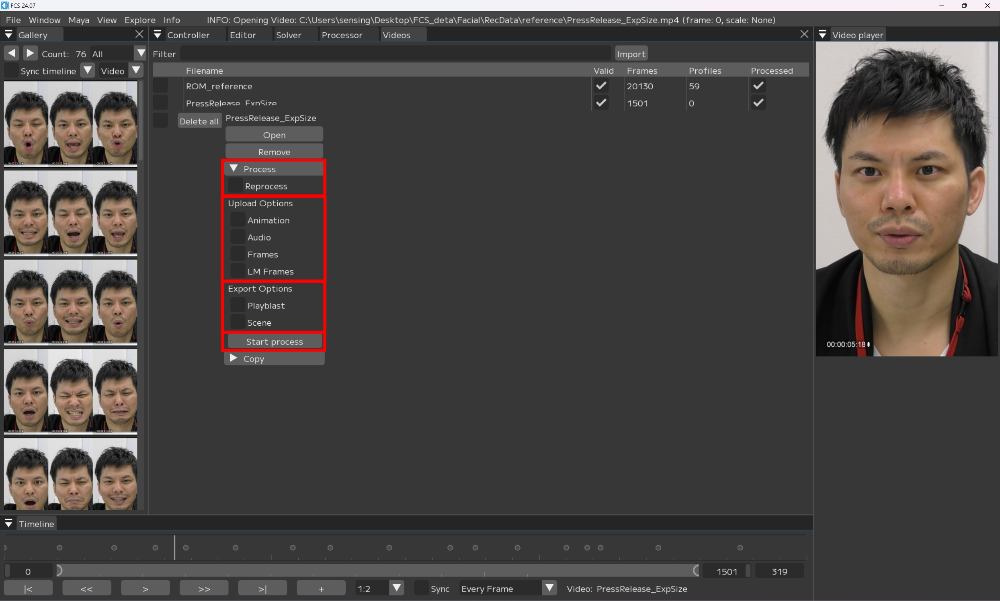
▼Process  

- [x] Reprocess：作成したProfile情報を読み取る  
```{note}
基本的に- [x] を付けることをオススメします。
```

Upload Options
- - [x] Animation：アニメーションデータを生成、Mayaに反映  
- - [x] Audio：解析する動画の音声データをMayaに反映  
- - [x] Frames：解析する動画の連番画像を生成、Mayaのイメージプレーン上に反映  
- - [x] Landmark Frames：顔の動きをオートトラッキングする連番画像を生成、Mayaのイメージプレーン上に反映    

Export Options  
- - [x] Playblast：出力されたアニメーションをmov形式の動画で出力、保存する  
- - [x] Scene：出力されたMayaシーンを自動で保存する  

Start process：アニメーションの出力を開始する

#### 単体のアニメーション出力方法

Videoウィンドウで  
 - 解析/出力したい動画名の上で右クリック   
画像のメニューが表示されるので  
 - ▼Process　を選択  
 - 該当する項目に- [x] を入れ  
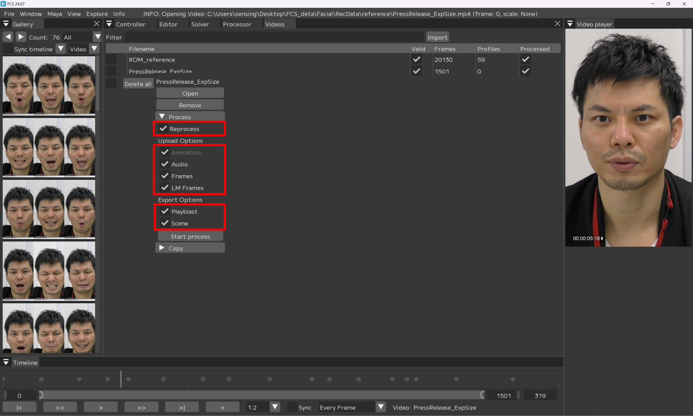

 - Start process
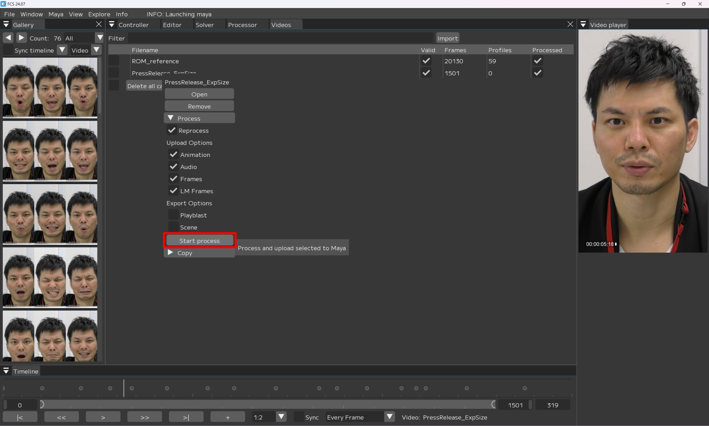

```{note}
 - 解析結果を見てから再度調整を行いたい場合はPlayblastやSceneの- [x] を外しておくと時間短縮できます。
```


 - 初回出力時は時間がかかるため待機
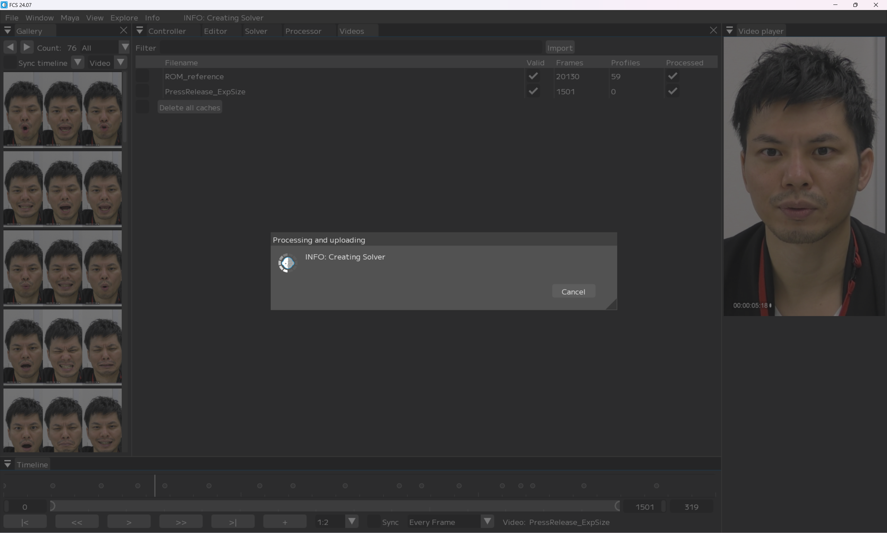

 - Mayaシーン上に- [x] を入れた項目が反映されていく  
　タイムスライダーに音声データ  
　イメージプレーンに連番画像  
　アニメーションデータ の順で反映される  
　アニメーションデータ反映時はスライダーが動く  
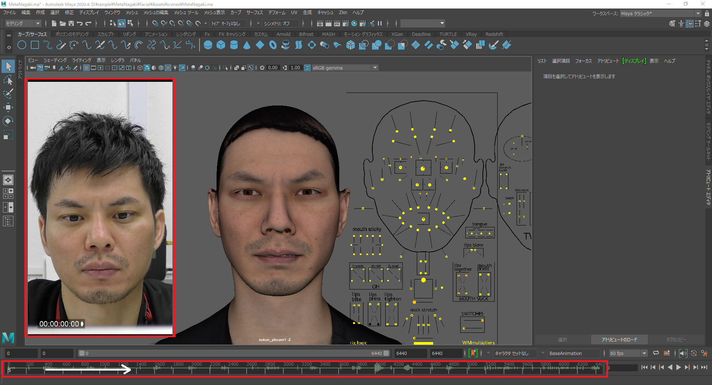

```{note}
【playblastやsceneに- [x] していた場合】  
出力が完了したらエクスプローラーがポップアップします。  
```
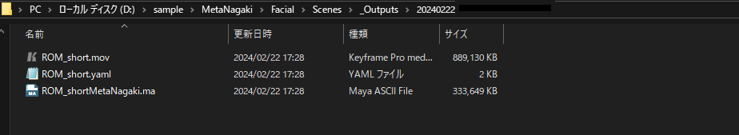


### 複数のアニメーション出力

#### 出力画面説明

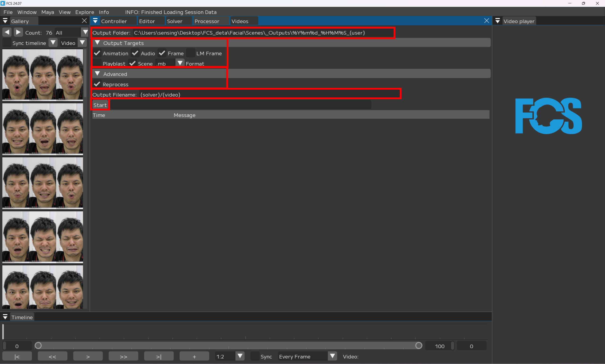
Output Folder：出力先を指定  

Output Targets  
- - [x] Animation：アニメーションデータを生成、Mayaに反映  
- - [x] Audio：解析する動画の音声データをMayaに反映  
- - [x] Frames：解析する動画の連番画像を生成、Mayaのイメージプレーン上に反映  
- - [x] Landmark Frames：顔の動きをオートトラッキングする連番画像を生成、Mayaのイメージプレーン上に反映  
- - [x] Playblast：出力されたアニメーションをmov形式の動画で出力、保存する  
- - [x] Scene：出力されたMayaシーンを自動で保存する  

Advenced  
- - [x] Reprocess：作成したProfile情報を読み取る 

Output Filename：出力されるデータ名。任意の名前に変更可能

Start：アニメーションの出力を開始する

#### 複数のアニメーション出力方法

Videoウィンドウで  
 - 解析/出力したい動画名の左側の- [x] をつける
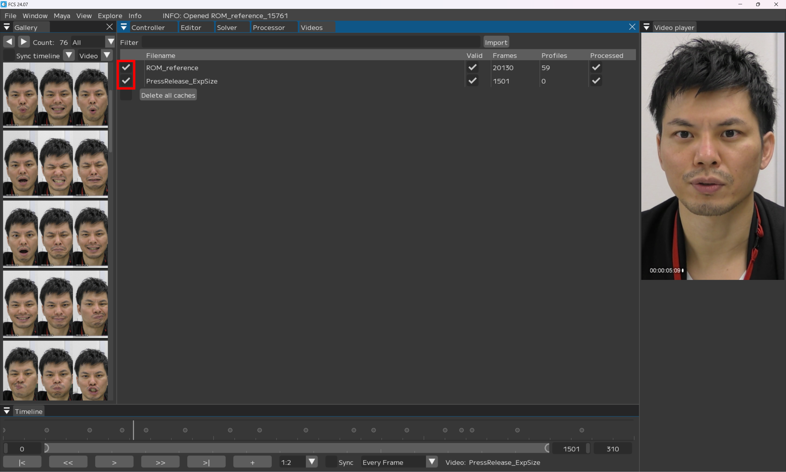

 - Processorウインドウを開く
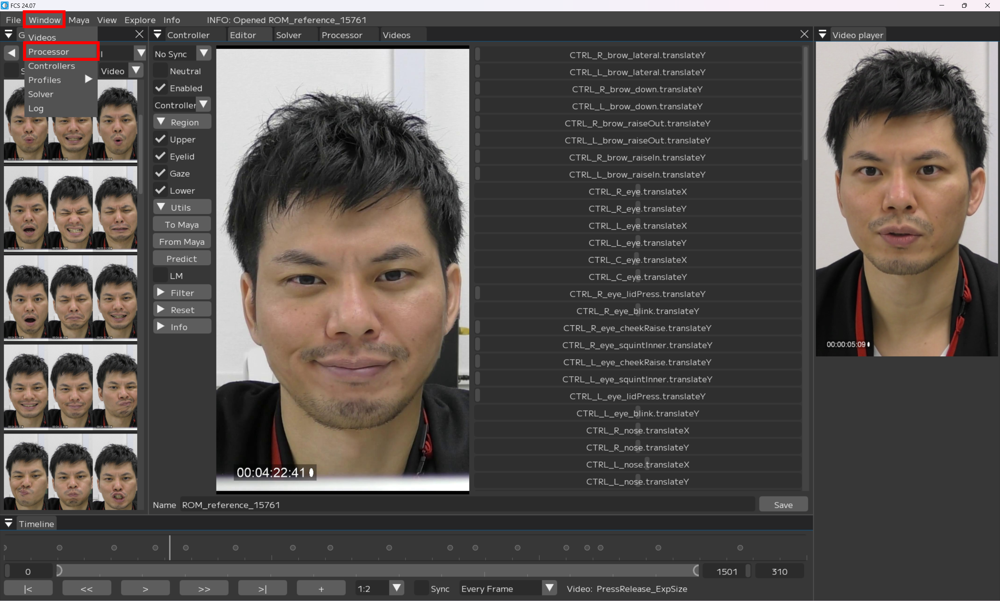
<br>

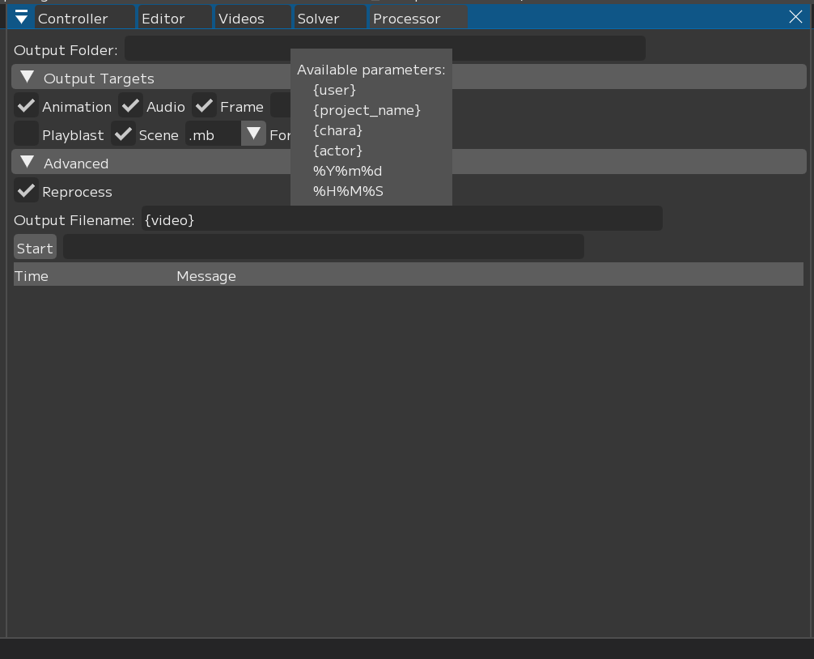

 - 該当する項目に- [x] を入れ  
 - Output Filename を任意の名前に変更
```{note}
- {solver} → solverの名前
- {video} → ビデオのファイル名
- {user} → windows ユーザ名
- {project} → 案件フォルダ名
- {chara} → キャラクター名
- {actor} → 役者名
- {%Y%m%d}, {%H%M%S} → 年月日、時間分秒  
{video}のみにするとimportした動画名で出力される
```
 - Start
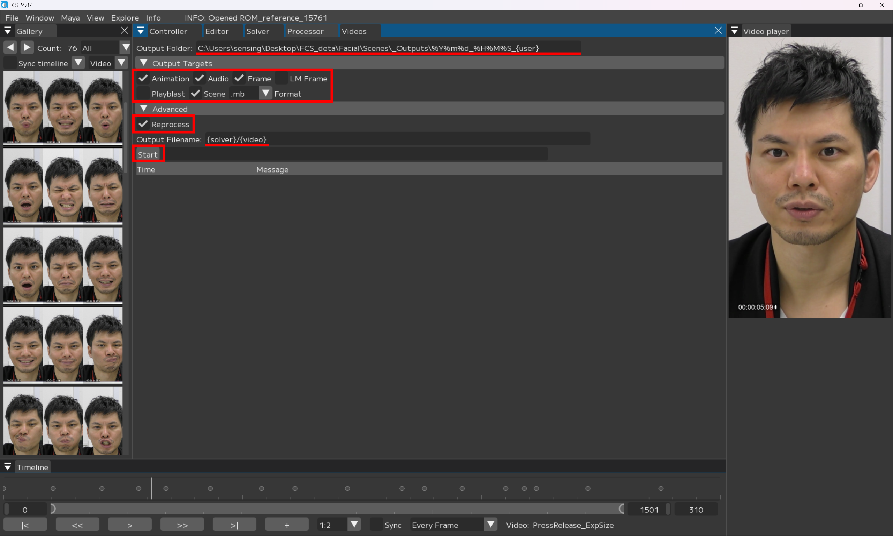

出力が完了したらエクスプローラーがポップアップします。
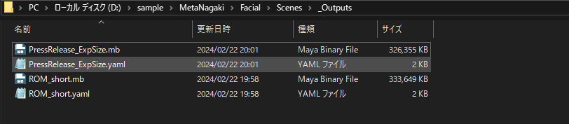  
