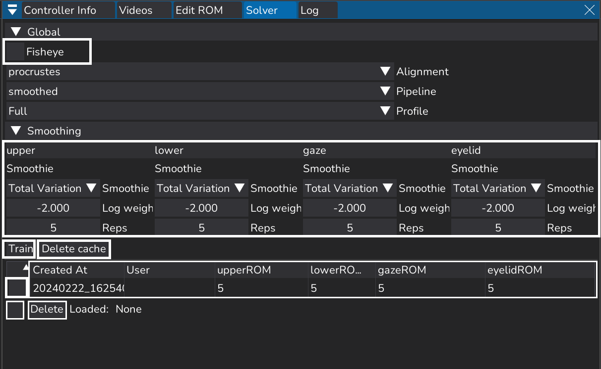
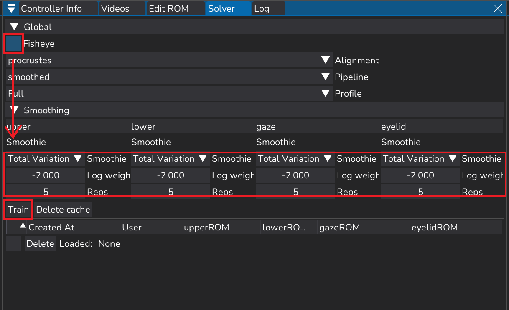
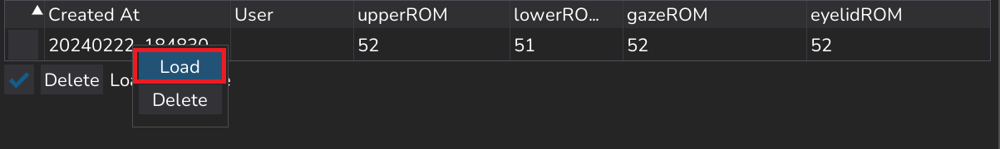
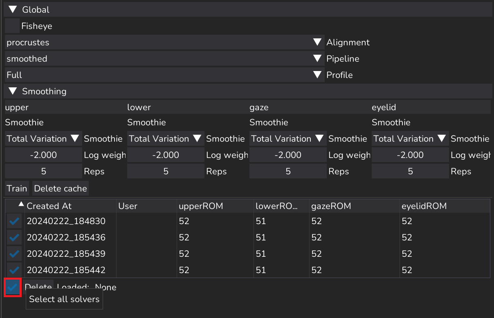
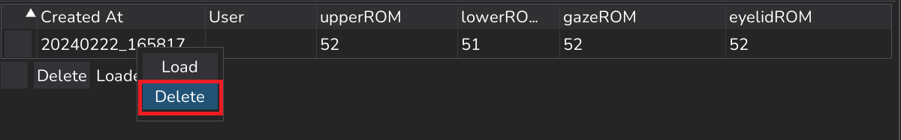
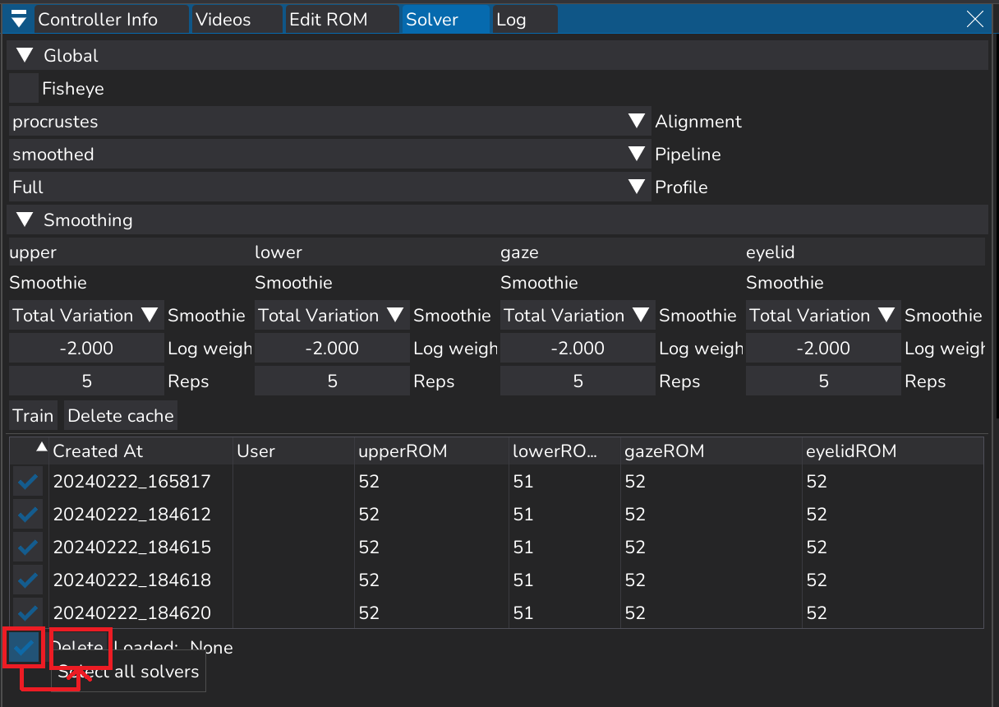
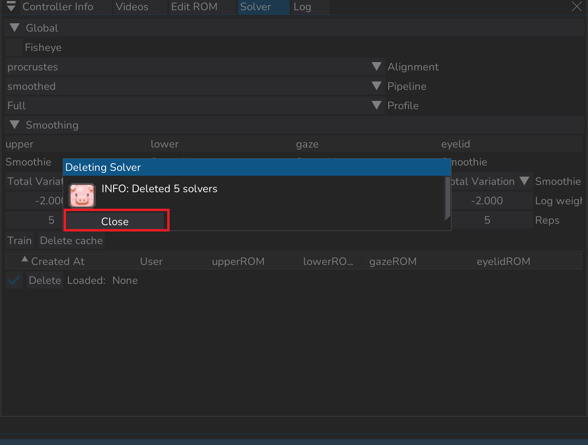

## Solverの設定方法

### Solverの画面説明
登録したProfileの情報を取得します。  
出力を行う際には必ずこの作業が必要です。


▼Global
- ✅Fisheye：魚眼レンズでの撮影の際は✅/広角レンズでの撮影の場合は外す  

▼smoothing：出力するアニメーションキーを滑らかにする機能
- Smoothie：滑らかにする方法。基本的に変更しない。
- Log Weight：強さ。値が+になるほど強く（滑らかに）、-になるほど弱く（荒く）なる。
- Reps：回数。回数が多いほど滑らかに、少ないほど荒くなる。
- Train：選択した項目でProfileを解析する
- Delete cache：キャッシュ削除
- チェックボックス：Trainしたログを選択する
- Trainログ：Trainした日付、出力者名、Profile数などが表示される。
- Delete：✅したログを削除する

### Profileを追加・削除・編集した/train履歴がない場合

▼Globalを開き  
Fisheyeの✅状況について選択  
魚眼レンズを使用して撮影した動画ではfisheyeに✅  
広角レンズで撮影した動画では✅を外します。


Total Variation（アニメーションキーを滑らかにする機能）の強さ（Log Weight）回数（Reps）を調整（任意）


・Train
Trainした日付や作業者名、Profile登録数などが表示されていればOK


### Profileを追加・削除・編集していない場合
読み込みたい項目の上で
・右クリック→Load


```{note}
★Trainする度にログが増えるので
同じ内容のものはLoadするようにしましょう
```

### 異なるSmootie値を一括出力する場合
・出力したいtrainログに✅

続きは複数データを出力する場合へ
```{note}
★全て選択する際は赤枠のボタンを選択すると全選択できる
```



### Solverの削除方法
【1つだけ削除したい場合】
Trainログの上で  
・右クリック→Delete


【複数のTrainログを削除したい場合】  
・削除したいログに✅を入れ  
・Delete


削除情報がポップアップするので  
・Close

