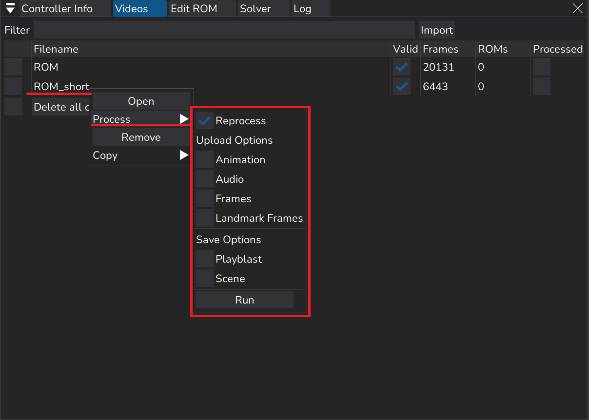
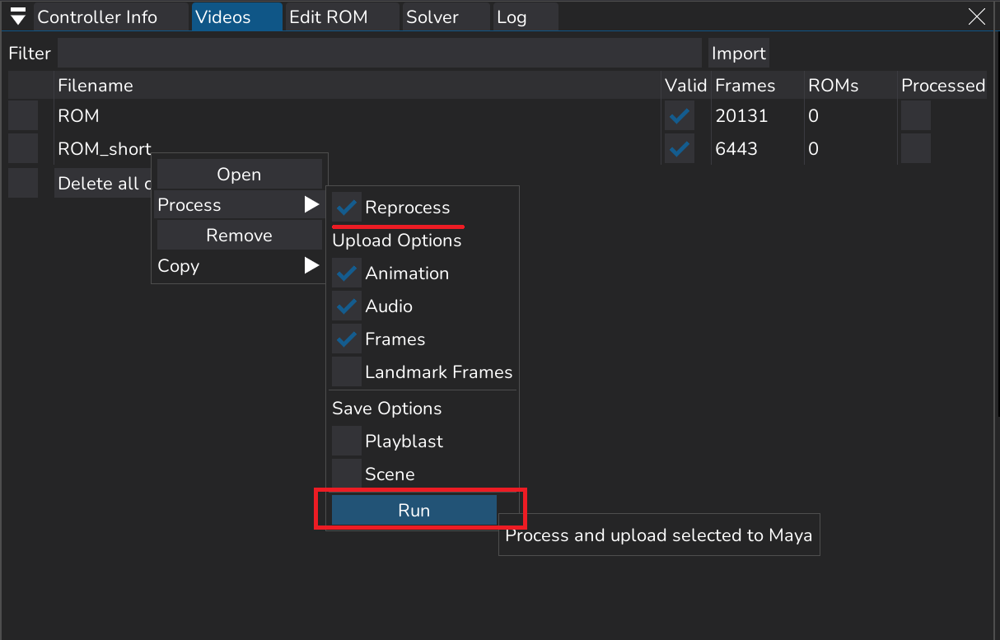
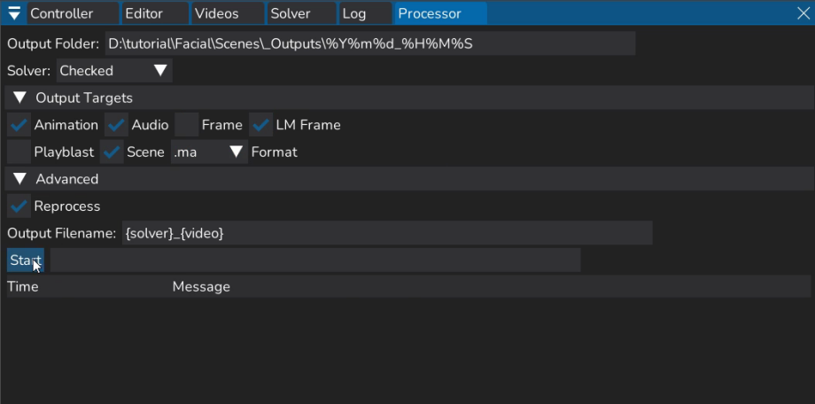
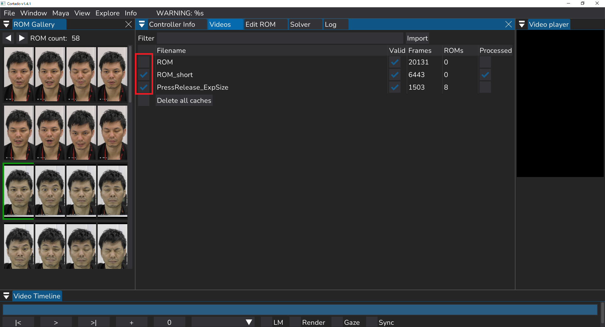
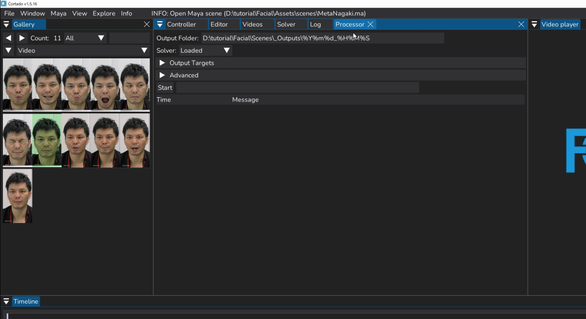
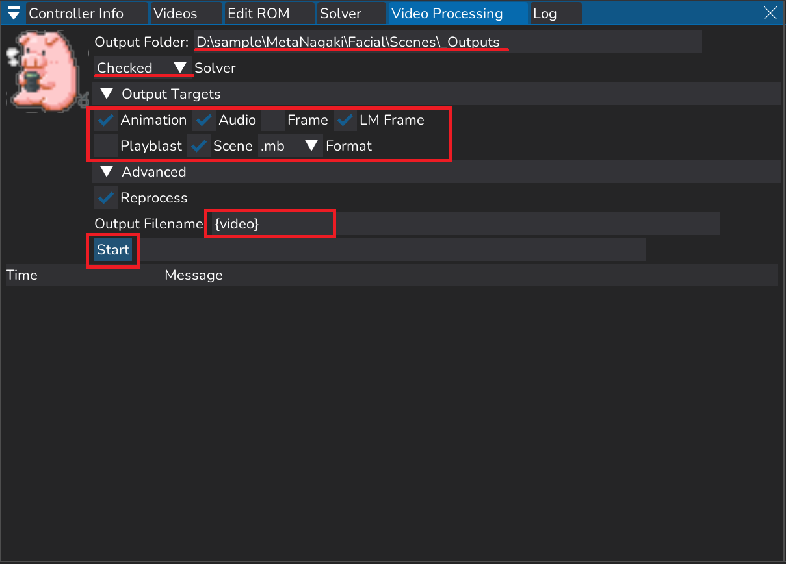

## アニメーションの出力方法

### アニメーション出力画面説明


✅Reprocess：Trainした情報を取得しなおす  
✅Animation：アニメーションデータを生成、Mayaに反映  
✅Audio：解析する動画の音声データをMayaに反映  
✅Frames：解析する動画の連番画像を生成、Mayaのイメージプレーン上に反映  
✅Landmark Frames：顔の動きをオートトラッキングする連番画像を生成、Mayaのイメージプレーン上に反映    

Save Options  
✅Playblast：出力されたアニメーションをmov形式の動画で出力、保存する  
✅Scene：出力されたMayaシーンを自動で保存する  

### データの単体出力方法

Train/Load後  
・解析/出力したい動画名の上で右クリック  
※framesが多ければ多いほど出力に時間がかかる  
画像のメニューが表示されるので  
・Process▶　を選択


・該当する項目に✅を入れ  
・Run


・解析結果を見てから再度調整を行いたい場合はPlayblastやSceneの✅を外しておくと時間短縮できる

・初回出力時は時間がかかるため待機

・Mayaシーン上に✅を入れた項目が反映されていく  
タイムスライダーに音声データ  
イメージプレーンに連番画像  
アニメーションデータ の順で反映される。  
アニメーションデータ反映時はスライダーが動く  


連番画像が固まっているので  
・イメージシーケンスの使用に✅  


```{note}
★Mayaの仕様で10000F以上の出力はエラーが出てしまうため  
デフォルトで✅を外しています
```

【playblastやsceneに✅していた場合】  
出力が完了したらエクスプローラーがポップアップします  


```{note}
★保存先が自動で開かれます
```


### データの複数出力方法


Output Folder：出力先を指定。  

Solver  
Loaded▼：出力したいSolverをTrain・Loadした場合選択  
checked▼：出力したいSolverを✅した場合選択  

Output Targets  
✅Animation：アニメーションデータを生成、Mayaに反映  
✅Audio：解析する動画の音声データをMayaに反映  
✅Frames：解析する動画の連番画像を生成、Mayaのイメージプレーン上に反映  
✅Landmark Frames：顔の動きをオートトラッキングする連番画像を生成、Mayaのイメージプレーン上に反映  
✅Playblast：出力されたアニメーションをmov形式の動画で出力、保存する  
✅Scene：出力されたMayaシーンを自動で保存する  

Advenced  
✅Reprocess：Trainした情報を取得しなおす。  
✅Output Filename：出力されるデータ名。任意の名前に変更可能

Start：出力開始


Videosウィンドウで  
・解析したい動画を**import**し  
・✅を入れる


・Processorウインドウをひらく


・該当する項目に✅を入れ/外し
・Output Filename を任意の名前に変更し
{video}のみでimportした動画名で出力される

・Start

```{note}
★途中でキャンセル不可
```

  
出力が完了したらエクスプローラーがポップアップします

```{note}
★保存先が自動で開かれます
```