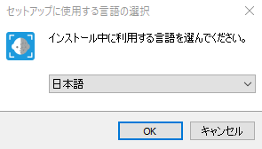
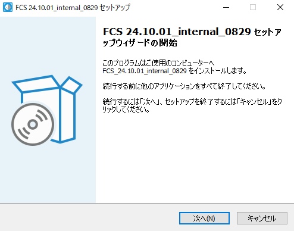
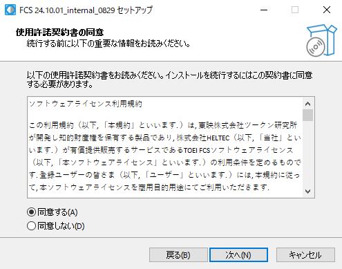
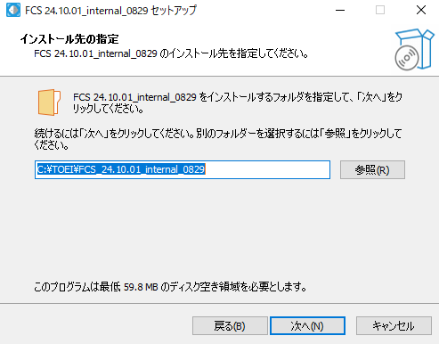
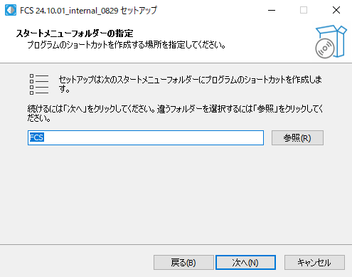
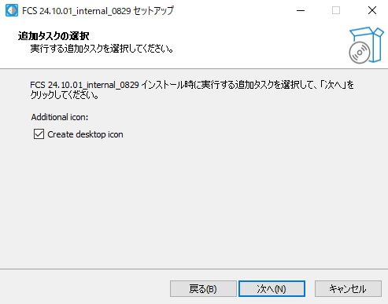
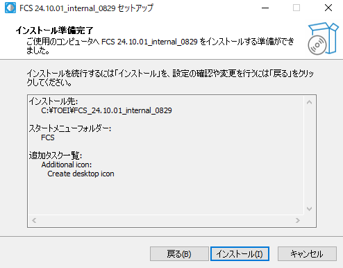
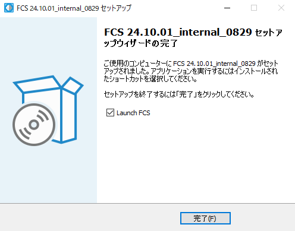
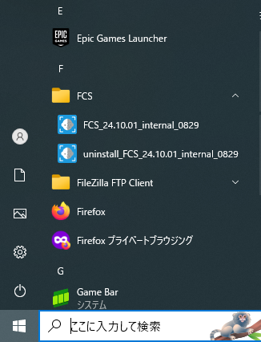
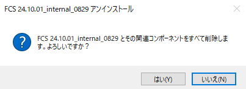

## FCSのインストール

FCSは、インストーラーを使用してインストールします。

**インストールの手順**   
1. インストーラーで使用する言語を設定します。  
  

2. インストールを開始します。
  
  
3. 使用許諾契約書に同意します。  
   
  
4. インストール先を指定します。  
デフォルトは、C:\TOEI\FCS_"version"です。  
変更する場合は、パスを記入、または参照から選択してください。  
   
  
5. スタートメニューフォルダを指定します。  
デフォルトはFCSです。  
変更する場合は、フォルダ名を記入、または参照から選択してください。  
    
  
6. デスクトップアイコンを作成する場合は、チェックを入れてください。
    
  
7. インストールを設定の確認し、問題がなければインストールしてください。  
    
   
8. 完了後、すぐ起動する場合は、チェックを入れてください。  
    
   

**アンインストールの手順**   
1. スタートメニューから、uninstall_FCS_"version"を実行します。  
  

2. 問題がなければOKを選択します。  
  