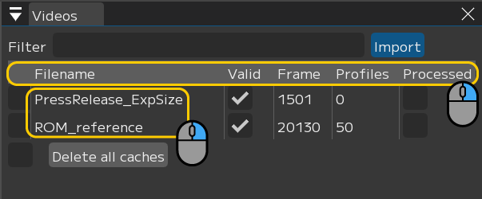
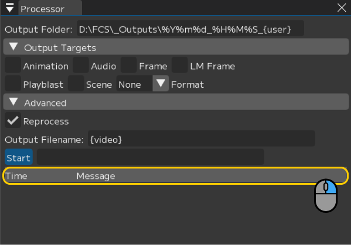
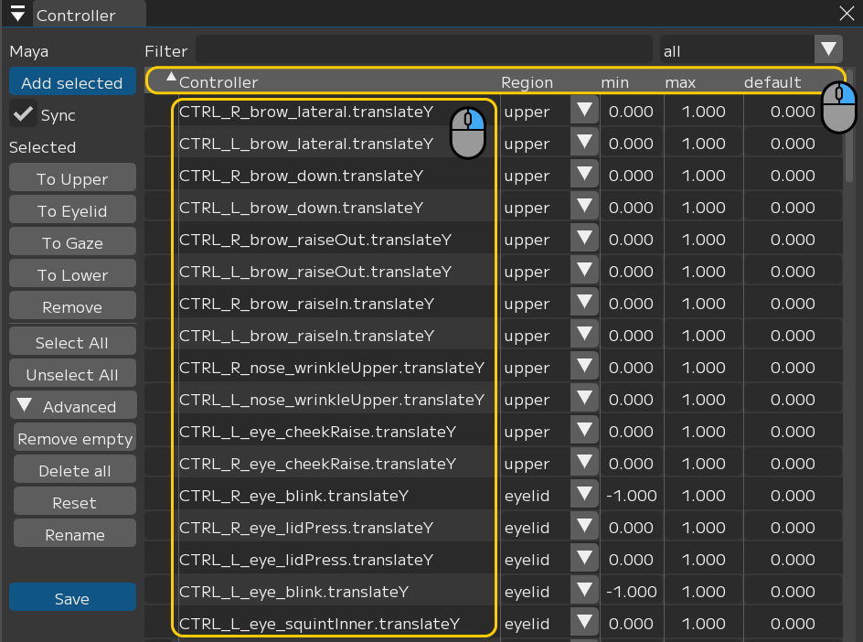
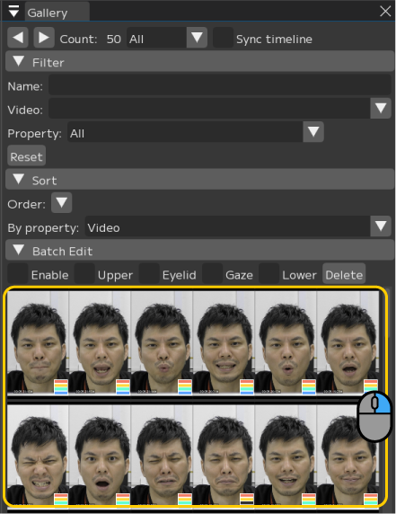
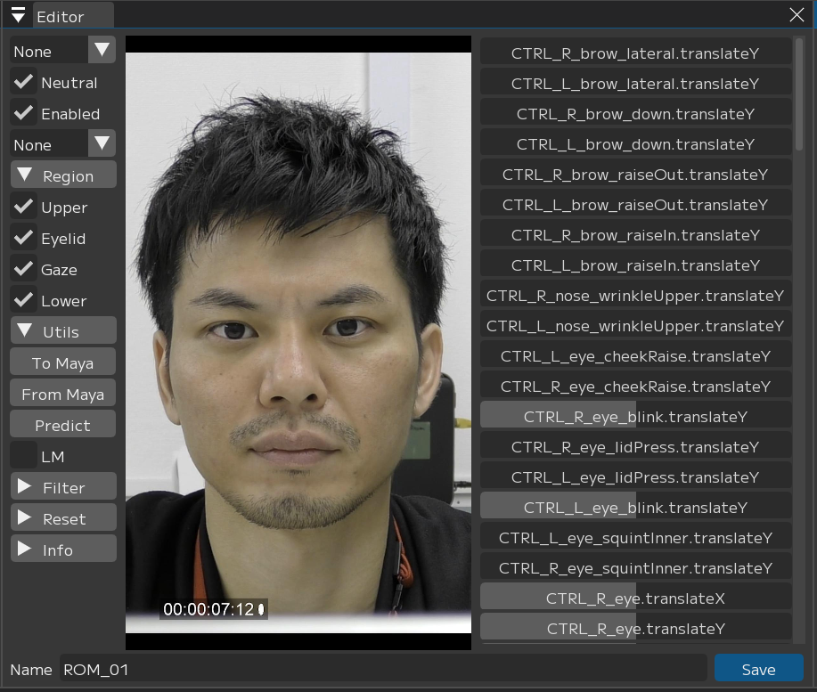
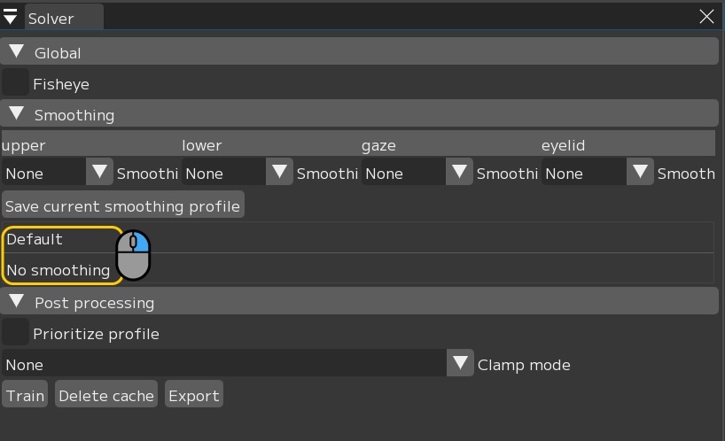
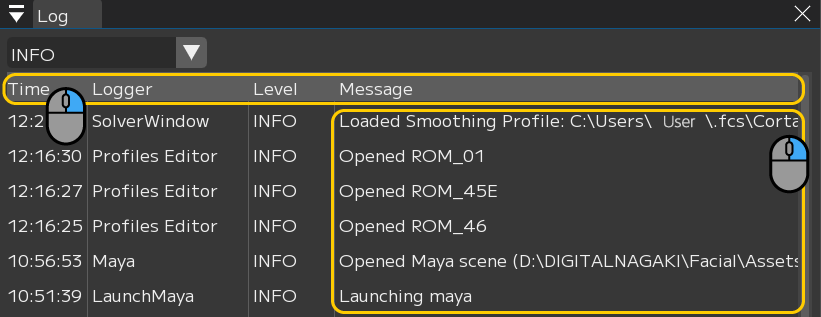

## 用語集

### LM（ランドマーク）
顔の各点の位置情報

### Pick up（ピックアップ）
表情出力の計算に含めたいフレームを抽出すること、またはピックアップしたデータのこと

### Profile（プロファイル）
動画からピックアップしたフレーム情報とリターゲットした表情の組み合わせのこと

### Region（リージョン）
コントローラのアトリビュートがupper / lower / eye / eyelidのどれに該当するかの情報
- upper：眉周りの動き
- lower：鼻、頬、口周りの動き
- eye：UIではgaze表記、目線の動き
- eyelid：まぶたの動き

### Retarget（リターゲット）
ピックアップしたフレームに対応する表情を登録すること、またはリターゲットしたデータのこと

### Session(セッション)
アクター情報、キャラクター情報、Mayaシーン情報とその解析データを紐づけたファイルのこと

### Window(ウィンドウ)
各機能ごとにまとめられた枠のこと

一部範囲では右クリックでメニューが表示される

ウィンドウのレイアウトは変更・保存することが可能
#### Videos(ビデオウィンドウ)

#### Processor(プロセッサーウィンドウ)

#### Controllers(コントローラーウィンドウ)

#### Gallery(ギャラリーウィンドウ)

#### Editor(エディターウィンドウ)

#### Solver(ソルバーウィンドウ)

#### Log(ログウィンドウ)

#### TimeLine(タイムラインウィンドウ)

