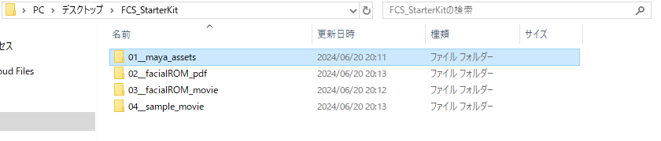
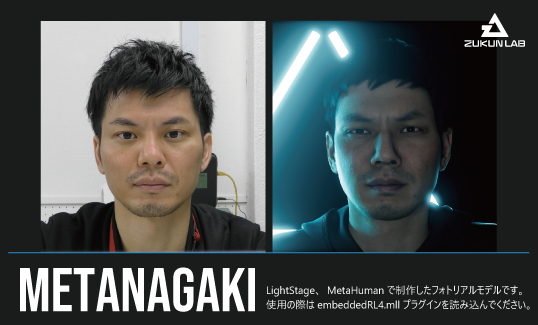
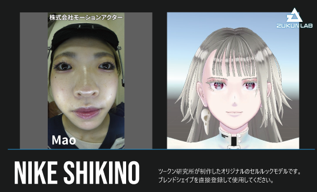
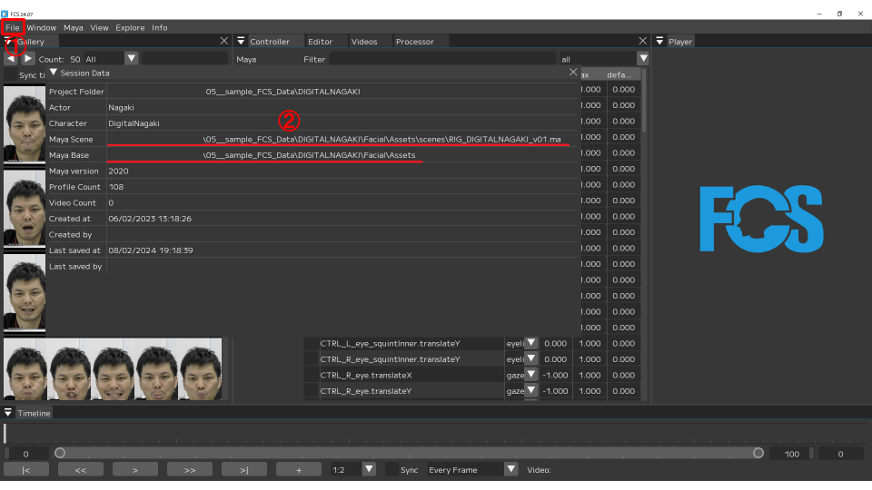
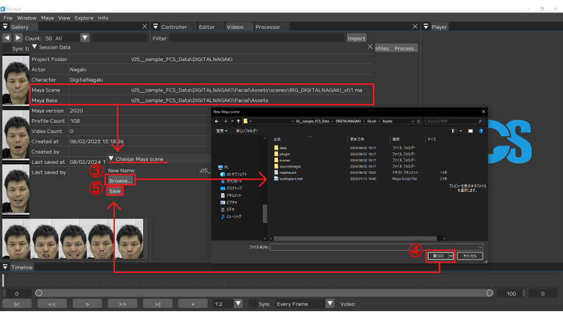
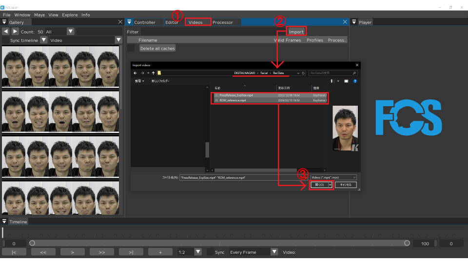

## FCSスターターキット
FCS製品版のご購入、体験版のトライアル申し込みをされた方は、FCSスターターキットをご利用いただくことができます。  
FCSスターターキットを使用することで、フェイシャルキャプチャー動画解析 - 3Dモデルへのアニメーション出力 - ゲームエンジンによるレンダリング確認まで、フェイシャルキャプチャーを用いたCG映像制作工程を通してFCSをご体験いただけます。  

### FCSスターターキットのコンテンツ一覧
FCSスターターキットには、以下のコンテンツが含まれています。  



1. Mayaの3Dモデルデータ
2. フェイシャルROM体操の表情一覧PDF
3. フェイシャルROM体操動画
4. 動画解析 - アニメーション出力用のサンプル動画
5. Profile作成済みのFCS Session参考例データ

```{note}
一部コンテンツのご利用には、サードパーティー製のゲームエンジン - プラグインを別途ご用意いただく必要がある場合があります。
```

### 1. Mayaの3Dモデルデータ
Mayaの3Dモデルデータフォルダには、以下の2種類のモデルデータが含まれています。

#### DIGITAL NAGAKI



DIGITAL NAGAKIとは、ツークン研究所のデジタルヒューマン技術（実在の人物をCGで再現する技術）と、Unreal Engineを開発するEpic Games社が提供するMetaHuman（デジタルヒューマン作成ツール）を組み合わせて制作されたハイエンド3Dモデルです。  
MetaHumanに関する詳細は、Epic Games社が提供する[MetaHuman紹介ホームページ](https://www.unrealengine.com/ja/metahuman)をご確認ください。  
  
DIGITAL NAGAKIは、MetaHuman標準のフェイシャルコントローラを使ってアニメーションさせることができます。  
MetaHumanフェイシャルコントローラの使い方は、Epic Games社が提供する[こちらのYouTube解説動画](https://www.youtube.com/watch?v=GEpH3o44_58)をご確認ください。  

ご利用の際には、同梱されているreadme.txtを必ずお読みください。

```{note}
DIGITAL NAGAKIをご利用される際は、Unreal Engineでの確認 - レンダリングが前提となります。  
事前にUnreal Engineのインストール、確認用プロジェクトの作成をお願いいたします。  
Unreal Engineに関する詳細は、Epic Games社が提供する[Unreal Engine紹介ホームページ](https://www.unrealengine.com/ja)をご確認ください。
```

```{caution}
Mayaでのレンダリングや、Unity*でのご利用はできませんのでご注意ください。  
*<span style="font-size:75%;">Unity Technologies社が開発 - 提供するゲームエンジン</span>
```

#### NIKE SHIKINO



NIKE SHIKINOとは、ツークン研究所が制作したオリジナルのセルルック3Dモデルです。  
モデルの顔にはApple ARKit*に準拠したブレンドシェイプが設定されており、各ターゲットシェイプの数値を変えることでアニメーションさせることができます。  
*<span style="font-size:75%;">Apple社が開発 - 提供するARフレームワークであり、フェイストラッキングシステムには52パターンの表情ターゲットシェイプが採用されている</span>
  
NIKE SHIKINOは、MayaやUnreal Engine、Unityでのご利用が可能です。  
ご利用の際には、同梱されているreadme.txtを必ずお読みください。

### 2. フェイシャルROM体操の表情一覧PDF
フェイシャルキャプチャーによる動画解析では、撮影された人物が取り得る表情の強度的な限界を知ることで、動画解析の効率性を高めることができます。  
眉や目、口などといった顔の各パーツの可動域（= ROM：**R**ange **O**f **M**otion）取得を目的とした一連の表情パターンのことを、フェイシャルROM体操と呼びます。  
本スターターキットでは、ツークン研究所がフェイシャルキャプチャー撮影で実際に使用している、約50パターンの表情リストをPDF化して同梱しています。  

### 3. フェイシャルROM体操動画
フェイシャルROM体操を収録した動画です。  
FCSに読み込ませてご利用ください。  

### 4. 動画解析 - アニメーション出力用のサンプル動画
動画解析で使用するサンプル動画です。  
FCSに読み込ませてご利用ください。  

<details>
<summary>サンプル動画の内容について</summary>

 - DIGITAL NAGAKI：FCS紹介動画  
 - NIKE SHIKINO：感情の異なる、全9種類のセリフ動画*（セリフ自体は全て同一です）  
  *<span style="font-size:75%;">株式会社モーションアクター - Mao様のご協力を得て収録</span>
</details>
<br>

### 5. Profile作成済みのFCS Session参考例データ
動画解析をお試しいただく際の参考例として作成された、DIGITAL NAGAKI＆NIKE SHIKINOのFCS Sessionデータです。  
どちらもフェイシャルROM体操動画から約50程度のProfileが既に作成済みのため、サンプル動画を読み込んでProfile作成をしていただくことで、ゼロからSessionを作成することなくFCSをご体験いただけます。

```{warning}
Profile作成をしなくても解析自体は可能ですが、それだけでは精度が十分ではないため、サンプル動画内からも最低1以上のProfile作成が必要です。  
Profileの具体的な作成方法については、[Profileの作成ページ](https://zukunfcs.github.io/fcs-doc/latest/jp/008_profile.html#profile)をご確認ください。
```

参考例データでは、解析に使用する各データ（スターターキットコンテンツ1 - 3 - 4と同一内容）が、予め作成されたFCS Sessionフォルダ構造内に置かれています。  
FCS Sessionフォルダ構造の詳細については、[Session作成もしくはオープンページ](https://zukunfcs.github.io/fcs-doc/latest/jp/005_session.html#session)をご確認ください。
<br>

ダウンロードいただいた直後では、Mayaデータやサンプル動画のパスが異なるため再設定が必要です。  
Mayaデータのパス再設定方法、サンプル動画のインポート方法については下記の手順を参考にしてください。

<details>
<summary>Mayaデータのパス再設定方法</summary>

Mayaデータについては、FCS上でMaya Sceneパス - Maya Baseパスそれぞれの再設定が必要です。  
どちらのパスも以下の手順で同様に再設定ができます。
<br>

①．FCSを起動してSessionを開いた後、File▶Session▶Infoウインドウを立ち上げる  
②．現在のパスが表示されている欄で右クリックし、Editボタンをクリックする  
③．Changeウインドウ内のBrowseボタンをクリックして、ファイルダイアログを起動する  
④．FCS Sessionフォルダ構造内の該当ファイルを選択して、開くボタンをクリックする  
⑤．Changeウインドウ内のパスが変更されたことを確認した後、Saveボタンをクリックする



</details>

<details>
<summary>サンプル動画のインポート方法</summary>

サンプル動画は、以下の手順でインポートできます。
<br>

①．FCSを起動してSessionを開いた後、Videosウインドウを立ち上げる  
②．Importボタンをクリックして、ファイルダイアログを起動する  
③．FCS Sessionフォルダ構造内の該当ファイルを選択し、開くボタンをクリックする


</details>
<br>

