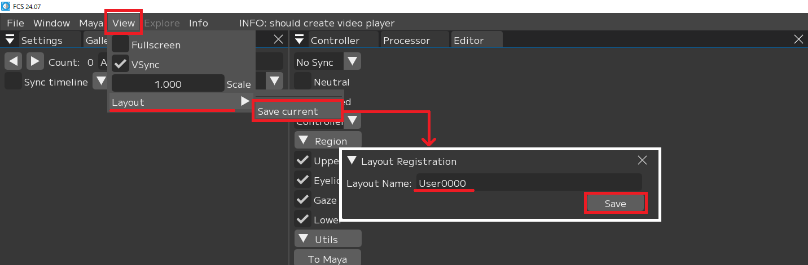

## よくある質問（FAQ）

### FCSを使うにあたって
<details>
<summary>Q：FCS操作時にインターネット接続は必要ですか？</summary>
<br>
 
**ネット接続は必須です。ライセンス情報の定期的なチェックにインターネットが必要です。  
Wi-Fi接続も可能ですが、有線接続を推奨しています。**
</details>

<br>
<details>
<summary>Q：PCのスペックの決まりはありますか？ </summary>
<br>
 
**最低スペック：  
CPU：Intel Core i5-9400F  
GPU：-   
メモリー：DDR4 16GB以上  
推奨スペック：  
CPU：Intel Core i7-13700K  
GPU：Nvidia RTX 3080  
メモリー：DDR4 128GB以上**
</details>

<br>
 
<details>
<summary>Q：専用のヘッドマウントカメラは必要ですか？  </summary>
<br>
 
**専用のカメラは不要です。  
市販のカメラ（Gopro、iPhone、Androidなど）を使用できます。固定カメラやヘッドマウントカメラも問題ありません。  
ご購入前に30日の無償トライアルライセンスで動作確認をおすすめします。**
</details>

<br>
 
<details>
<summary>Q：MacOSには対応していますか？</summary>
<br>
 
**現時点では対応していませんが、将来的には対応する予定です。（※2024年6月現在）**
</details>

<br>
 
<details>
<summary>Q：FCSを使用するにあたって、何か別のソフトは必要になりますか？ </summary>
<br>
 
**Mayaが必要です。（Maya 2018/2020/2022/2023/2024に対応）**
</details>

<br><br>

### FCSの機能について
<details>
<summary>Q：FCSは撮影の際、アクターにマーカーを付ける必要はありますか？  </summary>
<br>
 
**FCSはオートトラッキングを搭載しているため、アクターにマーカーを付ける必要はありません。**
</details>

<br>
 
<details>
<summary>Q：ランドマークがズレた際に修正できますか？    </summary>
<br>
 
**オートトラッキングのため、ランドマークのズレは修正できません。**
</details>

<br>
 
<details>
<summary>Q：舌のトラッキングはできますか？  </summary>
<br>
 
**舌のトラッキングには対応していません。**
</details>
<br>
 
<details>
<summary>Q：モーフではなくスケルトンにも対応していますか？  </summary>
<br>
 
**FCSはモーフだけでなくスケルトンにも対応しています。**
</details>
<br>

<details>
<summary>Q：同じ役者が複数キャラクターを担当しているのですが、Profileの使い回しができますか？  </summary>
<br>
 
**同じリグであればできます。  
Exportで新しいセッションファイルを作成していただき、紐付けるMayaファイルを変更してください。**
</details>
<br>

 
<details>
<summary>Q：Mayaを別途、起動する必要はありますか？  </summary>
<br>
 
**プロジェクトファイルを一度設定すれば、FCSからMayaをワンクリックで起動できます。**
</details>
<br>
 
<details>
<summary>Q：ライブキャラクターアニメーションはできますか？  </summary>
<br>
 
**現時点ではできませんが、将来的には対応する予定です。（※2024年6月現在）**
</details>

<br>
 
<details>
<summary>Q：Profileには、ROM体操は必須ですか？  </summary>
<br>
 
**ProfileにはROM体操が必須ではありませんが、精度向上のために追加することをおすすめします。**
</details>
<br>


<details>
<summary>Q：プラグインなどの関係上、Mayaを別途で起動させる必要がありますが、どうしたらよろしいでしょうか？  </summary>
<br>
 
**その際はMayaで手動でポート解放してください。  
Maya起動後、以下のコマンドをスクリプトエディター(Mel)に入力してください。    
```commandPort -stp "python" -n ":42069"```  
Mayaを起動するスクリプトに同じコマンドをテクニカル担当者様に追加していただければ同じ挙動ができるようになります。    
すでにポート42069が使われていた際、Settingsでポートを変更できるようになっております。**  
</details>
<br>
 
<details>
<summary>Q：マニュアル以外のコントローラーリグを追加することはできますか？ </summary>
<br>
 
**手順書以外のコントローラーリグでもUpper/eyelid/gaze/lowerに分類できる場合、任意で追加できます。**
</details>
<br>
 
<details>
<summary>Q：Metahuman以外のコントローラーリグにも対応していますか？  </summary>
<br>
 
**コントローラーのあるリグであれば基本的に対応しています。  
ブレンドシェイプやジョイントでもコントローラー登録とアニメーション出力が可能です。**
</details>
<br>
 
<details>
<summary>Q：解析動画に関して、画角が同じであれば撮影場所が変わっても問題ありませんか？   </summary>
<br>
 
**画角が同じであれば撮影場所が変わっても問題ありません。  
Profileのピックアップを追加することで対応できます。**
</details>
<br>
 
<details>
<summary>Q：動画の画質(フルHDと4Kなど)が変わると、オートトラッキング精度に影響がありますか？  
そのほかに影響が出るところはありますか？推奨はありますか？   </summary>
<br>
 
**極端に解像度の低い（480P以下）、または画質が悪いもの（照明が極めて暗い）を除き、動画の画質はオートトラッキング精度への影響が少ないです。**
</details>
<br>
 
<details>
<summary>Q：動画のリフレッシュレート(60fpsと120fpsなど)が変わると、オートトラッキング精度に影響がありますか？  
そのほかに影響が出るところはありますか？推奨はありますか？  </summary>
<br>
 
**できれば明るい場所で撮影してください。また、アクションシーンなどではフレームレートの高いカメラでモーションブラーの少ない撮影を心がけていただければ問題ありません。**
</details>
<br>
 
<details>
<summary>Q：再起動が必要な場合はありますか？  </summary>
<br>
 
**FCSの File▶Setting にて各種項目を変更できます。  
変更した内容は、再起動後に反映されるため、再起動が必要です。**

</details>
<br>

<details>
<summary>Q：レイアウトの登録はできますか？  </summary>
<br>
 
**FCSの View▶Layout にて登録時のレイアウト情報を保存できます。**

 - View▶Layout▶Save current　で　「Layout Registration」ウィンドウを起動<br>
 - 「Layout Name」を入力し<br>
 - Save<br>
で登録することができます

</details>

<br><br>

### ライセンスについて
<details>
<summary>Q：1ライセンスの場合、2台のPCで同時作業できますか？  </summary>
<br>
 
**できません。ただし、同時に起動しなければ複数台のPCで作業可能です。**
</details>
<br>
 
<details>
<summary>Q：金額はいくらですか？  </summary>
<br>
 
**年間サブスクリプションは40万円（税抜き）です。2024年12月末までに購入される方には、1ライセンスにつきもう1ライセンスが無償で付与されます。**
</details>
<br>
 
<details>
<summary>Q：購入後に自動的に契約更新になりますか？  </summary>
<br>
 
**購入後、自動的に契約更新は行われません。サブスクリプション終了1ヵ月前にFCSソフト内でポップアップが表示され、更新を希望する場合は弊社担当者にご連絡いただく必要があります。**
</details>
<br>
 
<details>
<summary>Q：更新をやめたいときはどうすればいいですか？  </summary>
<br>
 
**特別な操作は必要ありません。サブスクリプション終了期間までは使用できますが、終了後は使用できなくなります。**
</details>
<br>
 
<details>
<summary>Q：6か月で使用をやめたいときに、返金はありますか？  </summary>
<br>
 
**年間でのサブスクリプション契約のため、途中解約での返金はありません。**
</details>
<br>
 
<details>
<summary>Q：トライアルはどのくらいの期間、使用できますか？  </summary>
<br>
 
**トライアルは30日間お試しいただけます。  
詳細は[HELTECホームページ](https://sensing.heltec.co.jp/contact/)からお問い合わせください。**
</details>
<br>
 
<details>
<summary>Q：トライアル後に自動的に契約更新になりますか？  </summary>
<br>
 
**トライアル版から製品版への移行には別途購入手続きが必要です。  
詳細は[HELTECホームページ](https://sensing.heltec.co.jp/contact/)からお問い合わせください。**
</details>
<br>
 
<details>
<summary>Q："Internal Server Error"というメッセージが表示されてFCSを使用できません。どうしたら良いですか？  </summary>
<br>
 
**ライセンス情報をチェックするサーバーに問題が生じている状況です。  
サーバー側での対応が必要ですので、[HELTECホームページ](https://sensing.heltec.co.jp/contact/)からご連絡ください。**
</details>
<br><br>
